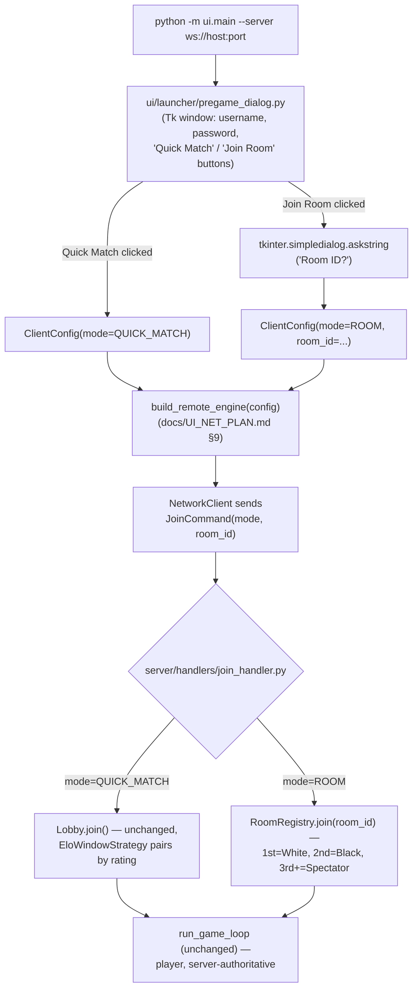

# Rooms & Spectators — Architecture Plan

This is a planning document, not yet implemented. It designs the second
of the two ways a game can start, per the roadmap already named in
[`docs/SERVER_PLAN.md`](SERVER_PLAN.md) §15 stage 5 ("Rooms
(`CreateRoomCommand`/`JoinRoomCommand`), spectators, client-side logs" —
slide 7) and closes [`docs/UI_NET_PLAN.md`](UI_NET_PLAN.md)'s unbuilt
client-side login/mode UI along the way (its open question #5: "once
there's an actual login UI ... not designed by this document").

**What ships:** the player picks one of two ways to start a game, from a
small pre-game window:

1. **Quick Match** — today's flow, unchanged: joins the ELO-matched
   anonymous queue, seated once `EloWindowStrategy` pairs two waiters.
2. **Room** — types a room id into a popup and presses Enter. The first
   two people who enter that same id become the two players (first is
   White); everyone after that becomes a **spectator** — read-only,
   sees the live board, cannot move or jump.

**Verified against the actual tree, not the older planning docs' assumed
state** — `docs/SERVER_PLAN.md` and `docs/SQLITE_PERSISTENCE_PLAN.md`
both open with "not yet implemented," but the code has moved past that:
`server/matchmaking/lobby.py` + `strategy.py`'s `EloWindowStrategy` (ELO
window matchmaking, stage 4) are live and wired into
`server/main.py::build_server()`; `server/persistence/sqlite_*.py`
(accounts, ELO, SQLite) is live; `SessionRegistry.reconnect()` +
`GameSession.reconnect()` (username-keyed reconnect) are live;
`server/handlers/disconnect_handler.py` + `GameSession._check_forfeits`
(20s disconnect-forfeit) are live. Conversely, **`ui/net/` does not
exist at all yet** — zero files under `ui/net/`, confirmed by a glob —
so `docs/UI_NET_PLAN.md` is still exactly what it says it is, a plan.
This document is additive to the live server code above and extends the
still-unbuilt `ui/net/` design in place, so both land coherently instead
of colliding later. Every file/line cited below
(`server/session/game_session.py`, `server/handlers/heartbeat_handler.py`,
`server/handlers/disconnect_handler.py`, `server/session/session_registry.py`,
`server/matchmaking/lobby.py`, `server/handlers/join_handler.py`,
`server/protocol/{commands,events,codec}.py`, `server/session/session_factory.py`)
was read directly from this repository this session.

## 1. Why a popup, and why Tkinter

The user-facing ask is literally "a popup window ... that can enter the
room id." `ui/platform/img_canvas.py`'s `Canvas` is an OpenCV window —
it has no text cursor, no keyboard-focus model, no IME support; getting
a string out of it means hand-building character-by-character key
capture and a blinking-cursor renderer inside `ui/rendering/`, which
`docs/UI_NET_PLAN.md` §0 already establishes must not change for
networking's sake, and which would be pure scope creep for a one-off
text field.

**Decision: a small `tkinter` window, shown once, before the OpenCV game
window ever opens, then torn down.** `tkinter` is stdlib (no new
dependency, same bar `docs/SQLITE_PERSISTENCE_PLAN.md` §7 already
applies to hashing) and gives a real modal dialog
(`tkinter.simpledialog.askstring`) for free. It also closes
`docs/UI_NET_PLAN.md`'s open question #5 head-on: that plan had no login
UI and let a bad password crash the process; this plan gives username
**and** password fields the same treatment as the room id, in the same
window, before a socket is ever opened.

**Alternative considered and rejected:** an in-canvas text widget.
Rejected because it would require new keyboard-focus and text-cursor
machinery inside `ui/rendering`/`ui/input` for a screen that exists for
about five seconds per session — a real OS dialog is a one-file,
already-tested, accessible solution to the same problem.

## 2. Product flow



`--server` absent (today's fully local `python -m ui.main`) never shows
the dialog at all — per `docs/UI_NET_PLAN.md` §9, the offline path stays
a zero-friction dev loop, not a second thing this plan is allowed to
slow down.

## 3. Wire protocol changes

`protocol/codec.py`'s `_decode_value` (`server/protocol/codec.py:161-207`)
already handles `Enum` fields and `Optional[X]` (`Union[X, None]`)
generically, driven by `get_type_hints` — confirmed by reading it, not
assumed. **This means every field added below needs zero codec.py
changes** — the existing generic (de)serialization already covers
`MatchMode` (a new `Enum`) and `Optional[str]`/`Optional[Color]` exactly
as it already covers `ErrorCode` and `Color`.

One real gotcha, worth naming precisely since it's easy to get wrong:
`_decode_dataclass` (`codec.py:151-158`) raises `MalformedMessageError`
if a field is **absent from the JSON payload**, regardless of whether
the dataclass has a Python-level default — defaults only apply to
direct Python construction, never to wire decoding. So `mode`/`room_id`
below are *not* wire-optional despite their `= ...` defaults; every
`JoinCommand` a client sends must include both keys (`room_id: null` for
quick match). This is a non-issue for backward compatibility today,
since no client (`ui/net/`) exists yet to be broken by it — flagged so
whoever implements `ui/net/`'s `NetworkClient` doesn't hit it as a
surprise `MalformedMessageError` from the server.

```python
# protocol/commands.py — additions
class MatchMode(Enum):
    QUICK_MATCH = "quick_match"
    ROOM = "room"

@dataclass(frozen=True)
class JoinCommand:
    trace_id: str
    username: str
    password: str
    mode: MatchMode = MatchMode.QUICK_MATCH   # Python-side default only — see the codec note above
    room_id: Optional[str] = None              # required iff mode is ROOM
```

```python
# protocol/events.py — one field widened, not a new event
@dataclass(frozen=True)
class WelcomeEvent:
    trace_id: str
    connection_id: str
    color: Optional[Color]   # CHANGED from `Color` (required) — None means "you are a spectator"
```

No new `Event` type for "you're a spectator" — reusing `WelcomeEvent`
with `color=None` keeps §5's closed-registry discipline (`docs/SERVER_PLAN.md`
§5: "This is the entire set needed ... not a sample of a larger set")
intact; a spectator is welcomed into the room exactly like a player,
just without a side to move. This is a real widening of an
already-implemented field, but its only consumer today is
`server/handlers/join_handler.py` itself (which currently always passes
a concrete `Color`) — `ui/net/`'s `RemoteGameEngine` doesn't exist yet to
migrate, so this lands as a day-one design, not a breaking change to a
shipped client.

```python
# protocol/errors.py — three additions to the closed ErrorCode set
class ErrorCode(Enum):
    ...  # existing members unchanged
    INVALID_ROOM_ID = "invalid_room_id"        # empty, too long, or bad charset — see §5
    ROOM_FULL = "room_full"                      # spectator cap reached — see §9
    SPECTATOR_CANNOT_ACT = "spectator_cannot_act"  # a spectator sent Move/JumpCommand — see §6
```

## 4. Design decision: one `JoinCommand`, not a two-step handshake

**Alternative considered and rejected:** split login (`LoginCommand`)
from mode selection (`QueueForMatchCommand` / `JoinRoomCommand`), acked
by a "you're authenticated, now pick a mode" event, then a second
round-trip to actually enter matchmaking or a room. Rejected because the
client already knows its mode and room id (if any) **before it ever
opens a socket** — the Tk dialog (§1/§2) collects everything up front.
Splitting it into two round-trips would only add a new event type and a
new pending-auth state to `JoinHandler` for information the client had
the whole time. Folding `mode`/`room_id` into the existing `JoinCommand`
is the same "additive field on an existing record" shape
`docs/SQLITE_PERSISTENCE_PLAN.md` §8 already used to add `password` to
this exact command — precedent already set in this codebase.

One consequence worth being explicit about: `JoinHandler`'s existing
username-reconnect check (`server/handlers/join_handler.py:73-83`,
`SessionRegistry.reconnect()`) stays **first and mode-agnostic** — a
returning player rejoins whatever session they were already in (room or
quick-match alike) without `mode`/`room_id` being consulted at all,
exactly as it does today. Rooms don't add a second reconnect mechanism;
they inherit the existing one for free because a room's `GameSession`
is stored in the same `SessionRegistry` as a quick-match one (an explicit
design goal restated from `docs/SERVER_PLAN.md` §15's own stage-5 row:
"`SessionRegistry` already supports N sessions").

## 5. `server/rooms/` — new package, sibling to `matchmaking/`

Not folded into `matchmaking/`: a `MatchmakingStrategy` (§6 of
`docs/SERVER_PLAN.md`) pairs opportunistically off one shared waiting
pool; a room is keyed by an explicit id the client supplies and has a
third participant kind (spectator) matchmaking never had. Different
enough shape to warrant its own package rather than stretching
`Waiter`/`MatchmakingStrategy` to cover it.

```
server/
  rooms/
    __init__.py
    room.py            # Room — mutable state for one room_id
    room_registry.py    # RoomRegistry.join() / .remove_participant() / .tick()
```

```python
# server/rooms/room.py
@dataclass
class Room:
    room_id: str
    white: Optional[_PendingPlayer]        # set once the 1st participant joins
    black: Optional[_PendingPlayer]        # set once the 2nd participant joins
    session: Optional[GameSession]          # created the instant `black` is set
    pending_spectator_ids: List[str]        # joined before `black` — attached at game start
    spectator_ids: Set[str]                 # joined after the game started

@dataclass(frozen=True)
class _PendingPlayer:
    connection: Connection
    username: str
    trace_id: str
```

`RoomRegistry.join()` returns one of four outcomes — a closed set, same
"typed result, not an exception or a None" discipline
`docs/SERVER_PLAN.md` §9.8 already uses for the command-processing chain:

```python
# server/rooms/room_registry.py
@dataclass(frozen=True)
class SeatedAsFirstPlayer:
    color: Color  # always Color.WHITE

@dataclass(frozen=True)
class RoomGameStarted:      # mirrors matchmaking.lobby.PairingResult
    session: GameSession
    white: PlayerSession
    black: PlayerSession
    white_trace_id: str
    black_trace_id: str
    attached_spectator_ids: Tuple[str, ...]   # pending spectators folded in at this instant

@dataclass(frozen=True)
class SeatedAsSpectator:
    session: Optional[GameSession]   # None if the room is still waiting on a 2nd player

@dataclass(frozen=True)
class RoomJoinRejected:
    reason: ErrorCode   # INVALID_ROOM_ID or ROOM_FULL


class RoomRegistry:
    def __init__(
        self, factory: GameSessionFactory, registry: SessionRegistry, config: ServerConfig
    ) -> None:
        self._factory = factory
        self._registry = registry
        self._config = config
        self._rooms: Dict[str, Room] = {}

    def join(
        self, connection: Connection, username: str, trace_id: str, room_id: str, now_ms: int
    ) -> SeatedAsFirstPlayer | RoomGameStarted | SeatedAsSpectator | RoomJoinRejected:
        if not _VALID_ROOM_ID.match(room_id):
            return RoomJoinRejected(ErrorCode.INVALID_ROOM_ID)

        room = self._rooms.setdefault(room_id, Room(room_id, None, None, None, [], set()))

        if room.white is None:
            room.white = _PendingPlayer(connection, username, trace_id)
            return SeatedAsFirstPlayer(Color.WHITE)

        if room.black is None:
            room.black = _PendingPlayer(connection, username, trace_id)
            session, players = self._factory.create(
                white_connection=room.white.connection, white_username=room.white.username,
                black_connection=connection, black_username=username, now_ms=now_ms,
            )
            self._registry.add(session)
            for spectator_id in room.pending_spectator_ids:
                session.add_spectator(spectator_id)
                self._registry.add_spectator(session.session_id, spectator_id)
            attached = tuple(room.pending_spectator_ids)
            room.session, room.pending_spectator_ids = session, []
            return RoomGameStarted(
                session, players[room.white.connection.id], players[connection.id],
                room.white.trace_id, trace_id, attached,
            )

        if len(room.spectator_ids) + len(room.pending_spectator_ids) >= self._config.max_spectators_per_room:
            return RoomJoinRejected(ErrorCode.ROOM_FULL)

        if room.session is not None:
            room.session.add_spectator(connection.id)
            self._registry.add_spectator(room.session.session_id, connection.id)
            room.spectator_ids.add(connection.id)
            return SeatedAsSpectator(room.session)

        room.pending_spectator_ids.append(connection.id)
        return SeatedAsSpectator(None)

    def remove_participant(self, connection_id: str) -> None:
        """§9 — disconnect cleanup for a participant who never made it into
        a GameSession (a solo pending White, or a pending spectator waiting
        on a 2nd player)."""
        for room in self._rooms.values():
            if room.white is not None and room.white.connection.id == connection_id and room.session is None:
                room.white = room.black  # promote a pending 2nd-slot spectator's non-issue: black is only ever set alongside session creation, so this just clears white
                room.white = None
            room.pending_spectator_ids = [c for c in room.pending_spectator_ids if c != connection_id]
```

(`_VALID_ROOM_ID = re.compile(r"^[A-Za-z0-9_-]{1,32}$")` — case-sensitive,
trimmed by the client before sending; see §12's known limitations for
why this is deliberately simple.)

Note the `remove_participant` sketch above is intentionally rougher than
the rest of this document — see §11 for why a solo abandoned White isn't
fully solved here.

## 6. `GameSession` changes: spectators are a second, unprivileged set

Reading `server/session/game_session.py` end to end surfaces two **real
bugs-to-be** that only show up once spectators exist, worth naming
precisely rather than leaving implicit:

- `_handle_move`/`_handle_jump` (`game_session.py:123-159`) do
  `player = self._players[connection_id]` — a **plain dict index**. A
  spectator's stray `MoveCommand` (e.g. an accidental click — nothing on
  the client stops them from clicking, per §8) would raise `KeyError`
  inside `_drain_pending()`, which runs synchronously inside
  `advance()` (`docs/SERVER_PLAN.md` §9.2) — an uncaught exception
  there would crash that session's tick, not just reject one command.
- `_broadcast` (`game_session.py:241-247`) sends only to
  `self._players.keys()` — spectators would never receive `StateEvent`/
  `GameOverEvent` at all without a change here.

Both are fixed by the same two additions:

```python
# server/session/game_session.py — additions/changes
def __init__(self, ..., spectator_ids: Optional[Set[str]] = None) -> None:
    ...
    self._spectator_ids: Set[str] = spectator_ids or set()

@property
def spectator_ids(self) -> FrozenSet[str]:
    return frozenset(self._spectator_ids)

def add_spectator(self, connection_id: str) -> None:
    self._spectator_ids.add(connection_id)

def remove_spectator(self, connection_id: str) -> None:
    self._spectator_ids.discard(connection_id)

def record_heartbeat(self, connection_id: str, now_ms: int) -> None:
    """Replaces HeartbeatHandler's direct `player_for(...).last_heartbeat_ms =`
    write (§7) — a no-op for a spectator (they have no PlayerSession, and
    don't need liveness/forfeit tracking, only the HeartbeatEvent reply
    itself, which doesn't require this write at all)."""
    player = self._players.get(connection_id)
    if player is not None:
        player.last_heartbeat_ms = now_ms

def _handle_move(self, connection_id: str, cmd: MoveCommand) -> None:
    player = self._players.get(connection_id)             # CHANGED: .get(), not [...]
    if player is None:                                      # CHANGED: spectator (or stale id) guard
        self._unicast(connection_id, MoveRejectedEvent(
            trace_id=cmd.trace_id, connection_id=connection_id, reason=ErrorCode.SPECTATOR_CANNOT_ACT))
        return
    piece = self._engine.get_snapshot().board.get(cmd.src)
    ...  # unchanged from here

def _broadcast(self, event: object) -> None:
    self._bus.publish(OUTBOUND, OutboundMessage.broadcast(
        event, list(self._players) + list(self._spectator_ids),   # CHANGED: union, not players-only
        session_id=self.session_id, engine_ms=self._engine_ms))
```

`_handle_jump` gets the identical `.get()`/guard change.
`GameSessionFactory.create()` (`server/session/session_factory.py`)
gains an optional `spectator_ids: Set[str] = ()` passthrough for the
`RoomGameStarted` case where spectators were already pending before the
session existed (§5).

## 7. `HeartbeatHandler` and `DisconnectHandler`: generalize past "always a player"

`server/handlers/heartbeat_handler.py:30` currently calls
`session.player_for(connection.id)`, which is `self._players[connection_id]`
(plain index, `server/session/game_session.py:71-72`) — the same
KeyError risk as §6, for a spectator's heartbeat. Fix: route through the
new `session.record_heartbeat(connection.id, now_ms)` (§6) instead —
the `HeartbeatEvent` reply itself (`server_time_ms=session.engine_ms`)
already works identically for a spectator, since it only reads the
session's shared engine clock, never a per-player field. This also
matters functionally, not just to avoid a crash: `docs/SERVER_PLAN.md`
§8 designed the heartbeat's clock-rebasing exchange specifically so a
**mid-game joiner** (its own words: "a spectator, or a reconnect") can
establish `ClockEstimator`'s offset — a spectator that can't safely send
heartbeats can't render smoothly interpolated motion at all. This is the
concrete case that "hard requirement, not deferred" language was written
for.

`server/handlers/disconnect_handler.py:36-40` already calls
`session.mark_disconnected(...)`, which already uses `.get()`
(`game_session.py:202`, confirmed by reading it) — safe as-is for a
spectator (no-op, since they have no `PlayerSession`). What it's
missing: actually removing a departed spectator from
`_spectator_ids`/`SessionRegistry`'s connection index, and from
`RoomRegistry`'s pending state if the game hadn't started yet. Extended:

```python
# server/handlers/disconnect_handler.py
class DisconnectHandler:
    def __init__(self, bus: EventBus, registry: SessionRegistry, lobby: _WaiterQueue, rooms: _RoomParticipantRemover) -> None:
        ...
        self._rooms = rooms

    def handle(self, message: ConnectionClosed) -> None:
        self._lobby.remove_waiter(message.connection_id)
        self._rooms.remove_participant(message.connection_id)        # NEW
        session = self._registry.find_session_for_connection(message.connection_id)
        if session is not None:
            session.mark_disconnected(message.connection_id, message.now_ms)
            session.remove_spectator(message.connection_id)            # NEW — no-op for a player id
            self._registry.remove_spectator(message.connection_id)      # NEW — index cleanup, see §8
```

(`_RoomParticipantRemover` is the same "structural Protocol, no direct
`rooms/` import from `handlers/`" seam `_WaiterQueue` already uses for
`Lobby` — sibling layers per `.importlinter`'s `server-layers` contract,
extended in §13.)

## 8. `SessionRegistry`: index spectators alongside players

`find_session_for_connection` (`server/session/session_registry.py:34-38`)
is keyed by `_session_id_by_connection`, populated only from
`session.player_ids` inside `.add()` (`session_registry.py:25-29`).
Spectators need the same lookup — it's what lets `HeartbeatHandler` and
`CommandDispatcher` find "which session is this connection in" without
caring whether it's a player or spectator connection.

```python
# server/session/session_registry.py — additions
def add_spectator(self, session_id: str, connection_id: str) -> None:
    self._session_id_by_connection[connection_id] = session_id

def remove_spectator(self, connection_id: str) -> None:
    self._session_id_by_connection.pop(connection_id, None)
```

The existing reap loop in `tick_all` (`session_registry.py:75-88`)
already iterates `session.player_ids` to clean up
`_session_id_by_connection`/`_session_id_by_username` when a finished
session's grace period elapses — extend that loop to also iterate
`session.spectator_ids` (usernames aren't tracked for spectators at all
in this milestone, §11, so only the connection index needs the extra
pass, not the username index).

## 9. `RoomRegistry.tick()`: reaping finished rooms, capping spectators

Once a room's `GameSession` is reaped by `SessionRegistry.tick_all`
(`docs/SERVER_PLAN.md` §9.6, untouched by this plan), the `Room` entry
in `RoomRegistry._rooms` should be dropped too — **so the room id
becomes reusable for a brand new game**, a deliberate product decision
worth stating explicitly (nothing about a room id is permanently
claimed). Checked from the scheduler, right after the existing
`registry.tick_all(now_ms)` call (`server/scheduler.py`, per
`docs/SERVER_PLAN.md` §9.1):

```python
# server/rooms/room_registry.py
def tick(self, now_ms: int) -> None:
    finished_ids = [
        room_id for room_id, room in self._rooms.items()
        if room.session is not None and room.session.session_id not in self._registry
    ]
    for room_id in finished_ids:
        del self._rooms[room_id]
```

`ServerConfig.max_spectators_per_room` (§10, default `50`) bounds
`RoomJoinRejected(ROOM_FULL)` in §5 — mostly a DoS guard at this
project's classroom scale (`docs/SERVER_PLAN.md` §16's own assumed
deployment size), not a hard product limit.

## 10. `ServerConfig` additions

```python
@dataclass(frozen=True)
class ServerConfig:
    ...                                    # every existing field unchanged
    max_spectators_per_room: int = 50      # ROOM_FULL threshold — §9
    room_id_max_length: int = 32           # matches _VALID_ROOM_ID's charset check — §5

    def __post_init__(self) -> None:
        ...
        if self.max_spectators_per_room < 0:
            raise ValueError("max_spectators_per_room must be non-negative")
        if self.room_id_max_length < 1:
            raise ValueError("room_id_max_length must be at least 1")
```

Same `from_env()` treatment (`SERVER_MAX_SPECTATORS_PER_ROOM`,
`SERVER_ROOM_ID_MAX_LENGTH`) as every existing field.

## 11. `JoinHandler` changes

```python
# server/handlers/join_handler.py — handle(), after the existing
# auth + reconnect-check block (both unchanged, §4)
if cmd.mode is MatchMode.QUICK_MATCH:
    result = self._lobby.join(connection, cmd.username, cmd.trace_id, now_ms, account.elo_rating)
    ...  # unchanged from here — today's Lobby flow

else:  # MatchMode.ROOM
    outcome = self._rooms.join(connection, cmd.username, cmd.trace_id, cmd.room_id, now_ms)

    if isinstance(outcome, RoomJoinRejected):
        self._publish_unicast(ErrorEvent(cmd.trace_id, connection.id, outcome.reason), connection.id)

    elif isinstance(outcome, SeatedAsFirstPlayer):
        self._publish_unicast(WelcomeEvent(cmd.trace_id, connection.id, outcome.color), connection.id)

    elif isinstance(outcome, RoomGameStarted):
        self._publish_unicast(WelcomeEvent(outcome.white_trace_id, outcome.white.id, Color.WHITE), outcome.white.id)
        self._publish_unicast(WelcomeEvent(outcome.black_trace_id, outcome.black.id, Color.BLACK), outcome.black.id)
        for spectator_id in outcome.attached_spectator_ids:
            self._publish_unicast(WelcomeEvent(cmd.trace_id, spectator_id, None), spectator_id)
        recipients = (outcome.white.id, outcome.black.id, *outcome.attached_spectator_ids)
        self._publish_broadcast(PlayerJoinedEvent(outcome.black_trace_id, Color.BLACK), recipients)

    elif isinstance(outcome, SeatedAsSpectator):
        self._publish_unicast(WelcomeEvent(cmd.trace_id, connection.id, None), connection.id)
        # no PlayerJoinedEvent here — StateEvent broadcasts (once a session
        # exists) are what actually shows them the game; nothing to announce
        # to the two players about a spectator arriving in this milestone.
```

Deliberate asymmetry with quick-match's "first joiner waits silently"
behavior (`docs/SERVER_PLAN.md` §5's note, `join_handler.py:87-91`):
**every room participant gets an immediate `WelcomeEvent`**, including a
solo first player and a spectator arriving before the game starts.
Reasoning: a quick-match joiner enters an anonymous pool with no
identity of its own to confirm; a room participant deliberately typed a
specific id and deserves immediate confirmation they're in the right
place — this also directly closes `docs/UI_NET_PLAN.md`'s open question
#6 ("a solo player's window shows an empty/waiting board with no
confirmation") for the room path specifically, though quick-match's
silent-first-joiner behavior is intentionally left as-is (§16 of that
document already names it as accepted, and this plan doesn't touch
`Lobby`).

## 12. Client side: `ui/launcher/` and `ui/net/` extensions

Extends `docs/UI_NET_PLAN.md` §3's `ClientConfig` sketch (still
unbuilt — this is the first design of these fields, not a migration):

```python
# ui/net/client_config.py
@dataclass(frozen=True)
class ClientConfig:
    uri: str
    username: str
    password: str
    mode: MatchMode = MatchMode.QUICK_MATCH   # NEW
    room_id: Optional[str] = None              # NEW
    heartbeat_interval_ms: int = 2000
    connect_timeout_s: float = 5.0

    def __post_init__(self) -> None:
        ...  # existing checks unchanged
        if self.mode is MatchMode.ROOM and not self.room_id:
            raise ValueError("room_id is required when mode is ROOM")
```

`NetworkClient._connect_and_read()` (`docs/UI_NET_PLAN.md` §7) sends
`JoinCommand(..., mode=config.mode, room_id=config.room_id)` — both keys
always present, per §3's codec gotcha.

`RemoteGameEngine._apply()` (`docs/UI_NET_PLAN.md` §4) already branches
on `WelcomeEvent`; the only change is `self._player_color = event.color`
now potentially storing `None`. **No further client change is needed
for read-only spectator enforcement**: `Controller`/`MouseAdapter`
(untouched, per §0's hard constraint) have no concept of "spectator" and
will still call `request_move`/`request_jump` on a stray click, which
`RemoteGameEngine` still sends as a `MoveCommand`/`JumpCommand`
optimistically (§4's existing "always return `True`" design) — the
server now rejects it with `MoveRejectedEvent(reason=SPECTATOR_CANNOT_ACT)`,
which `_apply()`'s existing `pass` branch for non-fatal rejections
already swallows silently. Enforcement is 100% server-side, by
construction, with zero new client logic — the same reuse this
architecture already banked on for ownership checks generally
(`docs/SERVER_PLAN.md` §7).

New package, the one and only place `tkinter` may be imported:

```python
# ui/launcher/pregame_dialog.py
def prompt_for_client_config(uri: str) -> Optional[ClientConfig]:
    """Blocking, synchronous, runs entirely before build_canvas() (per
    docs/UI_NET_PLAN.md §9) is ever called. Shows one Tk window: username
    + password entries, a 'Quick Match' button, and a 'Join Room' button.
    'Join Room' opens tkinter.simpledialog.askstring for the room id, then
    both paths close the Tk window and return a populated ClientConfig.
    Returns None if the window is closed without a choice — the caller
    should exit cleanly (docs/UI_NET_PLAN.md has no 'silently fall back
    to local play' precedent, and inventing one here would be surprising).
    """
```

`ui/main.py::main()` (§9 of `docs/UI_NET_PLAN.md`): when `--server` is
given and `--username`/`--room-id` are not both supplied on the CLI,
call `prompt_for_client_config()` first. `--server` absent → the dialog
is never imported or shown, exactly as today's fully local loop.

## 13. Design patterns used, and why

| Pattern | Where | Why here specifically |
|---|---|---|
| **Strategy** (informal, via mode dispatch) | `JoinHandler.handle()` branching on `cmd.mode` | `Lobby` and `RoomRegistry` are two independent ways to reach the same destination (a `GameSession` in `SessionRegistry`) — neither knows the other exists, matching `docs/SERVER_PLAN.md` §6's existing `MatchmakingStrategy` reasoning, just one layer up. |
| **Factory** | `RoomRegistry.join()` calling the existing `GameSessionFactory.create()` | Rooms don't reinvent session construction — they call the exact same factory `Lobby` already uses, so a room's `GameSession` is indistinguishable from a quick-match one to everything downstream (reconnect, reaping, heartbeat). |
| **Result type over exception/None** | `SeatedAsFirstPlayer` / `RoomGameStarted` / `SeatedAsSpectator` / `RoomJoinRejected` | Same "typed record, not an exception, not `None`" discipline `docs/SERVER_PLAN.md` §9.8 already uses for the whole command-processing chain — a room join has four genuinely different outcomes, and a caller can't accidentally forget to handle one when they're an exhaustive `isinstance` chain. |
| **Repository-adjacent read-only role** | `PlayerSession` (owns identity/color/liveness) vs. bare `connection_id` strings in `_spectator_ids` | A spectator deliberately gets **no** `PlayerSession` — they have no color, no username tracked server-side (§16), no forfeit/liveness stake in the game. Modeling them as "just an id in a set" rather than a degenerate `PlayerSession` keeps `_handle_move`/`_handle_jump`'s ownership check simple: "not in `_players`" already means "can't act," with no new field to check. |

## 14. `.importlinter` contract additions

Extends `docs/SERVER_PLAN.md` §10 and `docs/UI_NET_PLAN.md` §11:

```ini
[importlinter:contract:server-layers]
name = Server package layering is one-way
type = layers
layers =
    server.main
    server.handlers | server.matchmaking | server.rooms
    server.session
    server.transport | server.bus
    server.protocol | server.persistence

[importlinter:contract:launcher-is-the-only-tkinter-seam]
name = Only ui.launcher (and the ui.main composition root) may depend on tkinter
type = forbidden
source_modules = ui.animation, ui.rendering, ui.hud, ui.input, ui.events, ui.assets, ui.platform, ui.net
forbidden_modules = tkinter

[importlinter:contract:ui-net-is-the-only-network-seam]
# unchanged from docs/UI_NET_PLAN.md §11 — ui.launcher is new and
# deliberately absent from this contract's source_modules: it's allowed
# to import ui.net (to build a ClientConfig) same as ui.main already is.
```

## 15. Testing strategy

Mirrors `docs/SERVER_PLAN.md` §13 and `docs/SQLITE_PERSISTENCE_PLAN.md`
§10's existing split:

- **`RoomRegistry`** — pure, sync, tested by calling `.join()` directly
  with a `FakeConnection` (the same double `docs/SERVER_PLAN.md` §13
  already uses for transport): 1st joiner → `SeatedAsFirstPlayer(WHITE)`;
  2nd → `RoomGameStarted` with a real `GameSession` from a real
  `GameSessionFactory`; 3rd+ → `SeatedAsSpectator`; a spectator who
  joined before the 2nd player appears in `attached_spectator_ids` at
  pairing time; an invalid id (empty, too long, bad charset) →
  `RoomJoinRejected(INVALID_ROOM_ID)` without mutating `_rooms`; the
  `(max_spectators_per_room + 1)`-th spectator → `RoomJoinRejected(ROOM_FULL)`.
- **`GameSession` spectator behavior** — called directly with bare
  integers, no asyncio (`docs/SERVER_PLAN.md` §9's existing discipline):
  a `MoveCommand`/`JumpCommand` enqueued from a spectator connection id
  produces `MoveRejectedEvent(reason=SPECTATOR_CANNOT_ACT)` and does
  **not** raise `KeyError` (the regression this plan's §6 exists to
  prevent) and does not mutate the board; `_broadcast` reaches every id
  in `player_ids ∪ spectator_ids`; `record_heartbeat` on a spectator id
  is a no-op that doesn't raise.
- **`SessionRegistry`** — `add_spectator`/`remove_spectator` keep
  `find_session_for_connection` correct; the existing reap loop also
  clears spectator ids once a session's grace period elapses (no
  leaked entries after reap — provable by asserting the dict shrinks
  back to empty after a session with spectators finishes and is reaped).
- **`RoomRegistry.tick()`** — a room whose session has been reaped from
  `SessionRegistry` is removed from `RoomRegistry`; rejoining the same
  room id afterward starts a **new** room (fresh `SeatedAsFirstPlayer`),
  proving id reuse (§9) actually works, not just compiles.
- **`JoinHandler` room branch** — `FakeConnection`-based, mirroring
  existing `JoinHandler` tests: asserts the exact unicast/broadcast
  sequence in §11 for each of the four `RoomRegistry.join()` outcomes.
- **Codec round-trip** — `JoinCommand` with `mode=ROOM, room_id="abc123"`
  and with `mode=QUICK_MATCH, room_id=None` both round-trip;
  `WelcomeEvent(color=None)` round-trips (`Optional[Color]` handled by
  the existing generic `_decode_value`, §3 — this test exists to prove
  that claim, not just assert it in prose).
- **`ui/net/client_config.py`** — `ClientConfig(mode=ROOM, room_id=None)`
  raises at construction, same validated-dataclass discipline as every
  other config in this codebase.
- **`ui/launcher/pregame_dialog.py`** — not unit-testable in the usual
  sense (a real Tk event loop); verified manually per §17's phase table,
  same `pragma: no cover` carve-out `docs/SERVER_PLAN.md` §9.1 already
  gives `scheduler.py` for the same reason (nothing here is worth
  unit-testing in isolation from a real window).

## 16. Known limitations accepted for now

Same "named, not hidden" discipline as `docs/SERVER_PLAN.md` §16:

- **Room ids are not private.** Anyone who knows or guesses a room id
  can join it as a spectator (or as a player, if fewer than two have
  joined yet). No room password, no "private room" flag. Fine for a
  local/classroom deployment (the same scale every other doc in this
  set already assumes); a room password would be a straightforward
  addition to `JoinCommand`/`Room` later, not designed here.
- **No room browser / list-active-rooms command.** A player must already
  know the id (agreed out-of-band — verbally, in chat, whatever) to join
  one. Building a `ListRoomsCommand` is realistic future work, not
  scoped here.
- **No rematch / "play again" inside the same room.** Once a room's
  `GameSession` finishes and is reaped, the room id becomes available
  for a **new, unrelated** room (§9) — it does not restart the same
  match with the same participants. A rematch feature would need its
  own design (who initiates it, do spectators carry over) — not this
  document's scope.
- **Spectators have no reconnect identity**, unlike players
  (`docs/SERVER_PLAN.md` §16's "no reconnect identity" limitation,
  already accepted for players; this plan doesn't even track a
  spectator's username server-side, so there's nothing to match a
  reconnecting spectator back to). A dropped spectator connection that
  reconnects just rejoins as a new spectator (or could become a player,
  if a player slot happens to be open — no special-casing either way).
- **An abandoned solo White (never gets a 2nd player, then disconnects)
  leaves a `Room` entry with `session=None` in `RoomRegistry` until
  someone else reuses that exact room id or the process restarts** —
  §5's `remove_participant` sketch clears the pending player, but a room
  with zero remaining participants and no session isn't proactively
  swept on an idle timer in this milestone (unlike a finished session,
  which *is* reaped via §9's `tick()`, because that path already existed
  for `SessionRegistry` to piggyback on). At this project's scale (a
  handful of room ids per session, bounded by how many distinct strings
  get typed), the memory cost of a lingering empty `Room` struct is
  negligible — a real idle-room reaper is straightforward future work if
  this ever stops being true, not a stage-5 requirement.
- **Room ids are case-sensitive, exact-match, no normalization** beyond
  trimming whitespace client-side. Two people who type `"Game1"` and
  `"game1"` end up in different rooms with no error telling them why.
  Simplest possible rule for a first version; case-folding is a one-line
  change to `_VALID_ROOM_ID`'s comparison if this turns out to matter in
  practice.

## 17. Implementation phases & regression gate

Same gate discipline as every other plan in this set: `python -m pytest`
(existing suite, byte-for-byte unchanged) stays green throughout;
`import-linter` reports zero violations; no phase touches
`kungfu_chess/`, `ui/animation/`, `ui/rendering/`, `ui/hud/`,
`ui/input/mouse_adapter.py`, or `ui/events/`.

| Phase | Adds | Proven by |
|---|---|---|
| 0 | `MatchMode`, `JoinCommand.mode`/`.room_id`, `WelcomeEvent.color: Optional`, three new `ErrorCode` members | Codec round-trip tests (§15); existing quick-match codec tests still pass with `mode`/`room_id` added |
| 1 | `server/rooms/room.py`, `room_registry.py`; `ServerConfig` additions (§10); `.importlinter` layer update (§14) | `RoomRegistry` unit tests (§15), zero network, zero `GameSession` changes yet |
| 2 | `GameSession` spectator set + `.get()`-guarded `_handle_move`/`_handle_jump` + broadened `_broadcast` + `record_heartbeat` (§6); `SessionRegistry.add_spectator`/`remove_spectator` (§8); `GameSessionFactory` spectator passthrough | Direct-integer `GameSession` tests (§15): spectator move/jump rejected without `KeyError`; broadcast reaches spectators; heartbeat no-ops safely |
| 3 | `HeartbeatHandler`/`DisconnectHandler` updates (§7); `RoomRegistry.tick()` wired into the scheduler (§9) | Reap + id-reuse test (§15); disconnect-cleanup tests for a pending solo White and a pending spectator |
| 4 | `JoinHandler`'s room branch (§11) | `FakeConnection`-based handler tests asserting the exact event sequence per outcome (§15) |
| 5 | `ui/net/client_config.py` mode/room_id fields; `ui/launcher/pregame_dialog.py`; `ui/main.py` wiring | `ClientConfig` validation tests; manual verification per phase-table style already used in `docs/UI_NET_PLAN.md` §13: three `python -m ui.main --server ...` windows given the same room id show one board with two active players and one read-only spectator view |

## 18. Open questions before implementation starts

1. Exact `max_spectators_per_room` default (§10 ships `50` as a guess,
   same "not knowable from design alone" caveat `docs/SERVER_PLAN.md`
   §17 already applies to its own constants) — revisit once there's a
   real classroom-demo spectator count to measure against.
2. Should a spectator's `WelcomeEvent` (or a new lightweight event) also
   report which usernames are currently playing, so the spectator's UI
   could show player names? Not designed here — `WelcomeEvent` today
   carries no username at all, for either players or spectators; adding
   one is a small, independent extension if a future `ui/hud/` addition
   wants to display it.
3. Whether `RoomRegistry.remove_participant`'s handling of a
   pending-second-slot spectator (someone who joined as spectator #1
   before a 2nd player ever arrived, then disconnects before the game
   starts) needs a dedicated test beyond what §15 already lists — likely
   yes, flagged for whoever implements phase 3.
