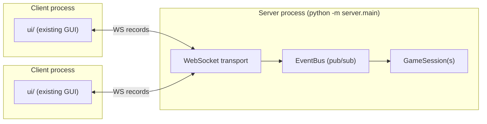
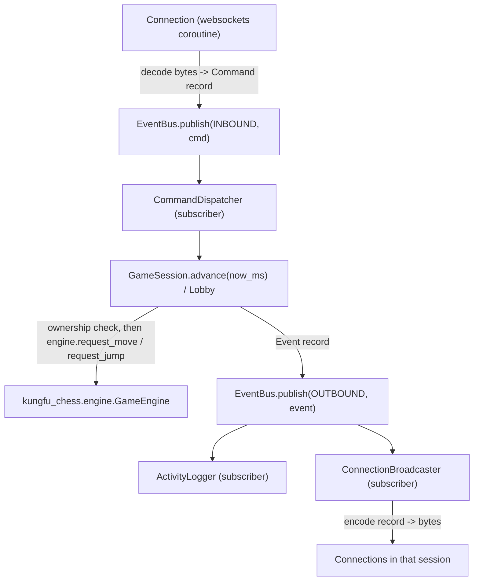

# KungFu Chess Server — Architecture Plan

This is a planning document, not yet implemented. It designs a WebSocket
game server for `kungfu_chess`, following the roadmap in `CTD 26 (Server)`:
start with a server that seats exactly **two** players in one game, but
architect it so the later stages (login/rating, ELO matchmaking, rooms
with spectators, disconnect countdowns) are additive, not rewrites.

Two hard constraints from the brief drive every decision below:

1. **The server is its own OS process.** It never imports UI code and is
   never imported by it. The only contract between server and client is
   the WebSocket wire protocol.
2. **Everything that crosses the wire is a record** (a typed, immutable
   dataclass), never a raw dict. Encoding/decoding is centralized in one
   place so the rest of the server only ever touches typed objects.

**Verified against the actual tree (not assumed):** the engine package is
`kungfu_chess/`, not `kfchess/`; `ui/events/event_bus.py` exists as
described in §3; `texttests/` contains exactly `script_parser.py` and
`script_runner.py` as described in §10. Every file path and line number
cited below (`real_time_arbiter.py:99-101`, `main.py:12-20`,
`texttests/script_runner.py:61-101`, `kungfu_chess/config.py:1-5`, ...)
was read directly from this repository, not inferred from a template.

## 1. Non-goals for this milestone

Matches slide 3 of the deck ("single-process server" / 2 clients). Out of
scope here, but every extension point below names the slide that adds it:

- Login, passwords, SQLite, ELO rating (slides 5–6).
- The disconnect **countdown-and-auto-resign policy** — 20 seconds, a
  visible countdown, resigning the game (slide 6). Note this is
  narrower than "disconnect handling" as a whole: the heartbeat/liveness
  *mechanism* that policy needs ships in this milestone (§8) precisely
  because it's wire-protocol plumbing that's expensive to retrofit later.
- Rooms with Create/Join/Cancel and spectators (slide 7).

## 2. Process topology



The server is started independently (`python -m server.main`) and only
ever talks to the outside world over WebSocket. It owns no display, no
mouse/keyboard input, nothing from `ui/`. It *does* reuse `kungfu_chess/`
(the engine) exactly as `ui/main.py` and root `main.py` already do — the
engine stays the single source of truth for rules/timing regardless of
who's driving it.

## 3. Internal architecture — a message bus, not a call stack

The transport layer never calls game logic directly, and game logic never
touches sockets directly. Everything flows through one in-process
publish/subscribe bus. This is the same Observer shape `ui/events/event_bus.py`
already uses for the HUD — this plan generalizes it to a typed,
multi-topic, async bus and makes it the backbone of the whole server
rather than a one-off wiring for a sidebar.



Why a bus instead of direct calls: adding "update scores", "move log",
"sound", "start/end animation" (slide 2 of the deck, already the stated
purpose of the bus) is then just *another subscriber* — nothing upstream
changes. It also means `ActivityLogger` (server-side logging, slide 7)
and matchmaking/session code are decoupled: neither knows the other
exists. Note the **ownership check** sitting between the dispatcher and
the engine call — see §7, it's load-bearing, not decorative.

## 4. Package layout

```
server/
  __init__.py
  main.py                    # composition root — the only file that wires concretes together
  config.py                  # ServerConfig — a validated dataclass, not bare constants; see §12
  scheduler.py                # the ONE async driver loop — see §9. pragma: no cover.

  protocol/                  # the "records" — the only things allowed on the wire
    commands.py              # client -> server: JoinCommand, MoveCommand, JumpCommand, HeartbeatCommand
    events.py                # server -> client: WelcomeEvent, StateEvent, HeartbeatEvent, ErrorEvent, ...
    state_records.py          # PieceRecord / MotionRecord / JumpRecord — the structured StateEvent payload, see §5
    errors.py                  # ErrorCode — one shared enum for MoveRejectedEvent/ErrorEvent.reason, see §5
    codec.py                  # Record <-> JSON, via a type-name registry (Factory)

  bus/
    event_bus.py             # EventBus: subscribe(topic, handler), publish(topic, record) — synchronous, see §9.2
    topics.py                 # Topic constants (INBOUND, OUTBOUND, LOG, LIFECYCLE, ...)

  transport/
    ws_server.py              # asyncio websockets.serve(max_size=config.max_frame_bytes); one coroutine per connection, I/O only — see §9.8
    connection.py             # Connection protocol: id, send(record); real + fake impls

  session/
    manual_clock.py            # ManualClock(IClock) — the server's own now_ms-driven clock; see §9.1
    player_session.py          # one connected player: id, username, Connection, color, ConnectionState, last_heartbeat_ms
    game_session.py             # GameEngine + RealTimeArbiter + its two players; owns the pending-command deque; .advance(now_ms) — pure, sync, see §9
    state_mapper.py             # GameSnapshot -> StateEvent/PieceRecord/MotionRecord/JumpRecord (§5) — a pure function; lives here or inline in game_session.py, decided at implementation time, no architecture riding on which
    session_factory.py          # builds a GameEngine exactly like ui/main.py::build_engine() does, wraps it in a GameSession
    session_registry.py         # active GameSessions, keyed by session id; .tick_all(now_ms) — pure, sync

  matchmaking/
    lobby.py                   # MatchmakingStrategy impl #1: first two joiners are paired (Stage 1 rule from slide 4)
    strategy.py                 # MatchmakingStrategy Protocol — later ELO-window / room-code strategies implement this, unchanged callers

  handlers/
    command_dispatcher.py      # Command pattern: {type(cmd): handler} map, built once in main.py via DI
    join_handler.py, move_handler.py, jump_handler.py, heartbeat_handler.py
    rate_limiter.py             # per-connection token bucket, consulted by the dispatcher before enqueue; see §9.7

  logging_/
    activity_logger.py         # subscribes to bus (both INBOUND and OUTBOUND), writes structured JSON log lines keyed by trace_id — see §5, §9.8

  persistence/                 # interfaces only in this milestone; slide 5/6 fill in the SQLite impl
    user_repository.py         # UserRepository Protocol (+ InMemoryUserRepository for now)
```

This mirrors the existing repo's shape on purpose: `kungfu_chess/` is
layered (`model` → `rules`/`realtime` → `engine`) and `ui/` is layered
(`platform` → `rendering` → `animation`/`hud`/`input`) with one
composition root each (`ui/main.py`). `server/` gets the same treatment —
see §10 for how that layering is checked, not just asserted in prose.

**This is already a Presentation/Application/Domain split, named
explicitly so a review doesn't re-flag it as missing:** `transport/` is
Presentation — the only place a raw `websockets` object exists, behind
the `Connection` protocol. `handlers/` and `matchmaking/` are
Application — orchestration that knows about connections and sessions
but not about chess rules. `session/` (plus the untouched `kungfu_chess/`
it wraps) is Domain — `session/player_session.py`'s `PlayerSession`
holds an `id`, a `Connection` (the protocol, never the raw socket), a
`color`, and `ConnectionState`; it has never held a raw socket in this
design, so there's no socket-out-of-the-domain-layer refactor to do
here — just this paragraph, so the mapping is stated instead of implied.

`activity_logger.py` subscribes to **both** `Topics.INBOUND` and
`Topics.OUTBOUND` (not outbound-only, as an earlier draft of this
section implied) and writes one JSON line per record: `timestamp`,
`trace_id` (§5), `connection_id`, `session_id` (when applicable),
`direction` (`"in"`/`"out"`), the record's own `type`, and — for records
that flow through `GameSession.advance()` — the `engine_ms` they were
applied/published at (§9.1). That schema is deliberately just
key-value JSON per line, no custom format, so it drops into ELK/Grafana-
style log ingestion without a translation step. Logging both directions
with `trace_id` and `engine_ms` is also what makes a full command
history reconstructable later without building anything else now — see
§9.8 and §16.

## 5. The wire protocol — the complete stage-1 surface

Every message is a frozen dataclass with a `type` discriminator, JSON on
the wire. `protocol/codec.py` is the *only* file that knows how a record
turns into bytes; nothing else in the server calls `json.dumps`/`loads`.
This is the **entire** set needed for two players, one game, no rooms —
not a "..." sample of a larger set.

Every `Command` and every `Event` also carries a `trace_id: str`
(UUIDv4). `transport/ws_server.py` generates one per inbound frame,
before decode; every `Event` a `Command` produces (directly, via a
handler's return value, or indirectly, via whatever it publishes) copies
that same `trace_id` forward. Events with no originating command — a
periodic `StateEvent` broadcast from `advance()`'s own tick, not from a
client message — get a fresh `trace_id` generated at publish time
instead, since there's no inbound frame to inherit from. This is what
lets `ActivityLogger` (§4) and a future client-side debug view answer
"which request produced this response, or this rejection" without
guessing from timing alone — the same problem heartbeat's shared clock
basis (§8) solves for time, this solves for causality.

```python
# protocol/commands.py — client -> server
@dataclass(frozen=True)
class JoinCommand:
    trace_id: str            # generated at transport/ws_server.py ingress — see above
    username: str

@dataclass(frozen=True)
class MoveCommand:
    trace_id: str
    src: Position          # reuses kungfu_chess.model.Position — no re-invented coordinate type
    dst: Position
    # deliberately no `color` field — see the rule in §7

@dataclass(frozen=True)
class JumpCommand:
    trace_id: str
    position: Position
    # deliberately no `color` field — see the rule in §7

@dataclass(frozen=True)
class HeartbeatCommand:    # sent every ServerConfig.heartbeat_interval_ms — see §8
    trace_id: str
    client_send_ms: int     # the client's own clock reading, opaque to the server; echoed back verbatim
```

```python
# protocol/state_records.py — the structured payload of StateEvent, shaped
# to be a direct wire serialization of kungfu_chess.engine.GameSnapshot,
# so a networked client's rendering pipeline can reuse
# ui/animation/scene_builder.py's interpolation logic almost unchanged —
# fed from decoded records instead of a live GameSnapshot. Built now,
# not retrofitted later: every client subscriber would need rewriting
# if this shape changed after the fact.
@dataclass(frozen=True)
class PieceRecord:
    id: str
    color: Color
    kind: PieceKind
    cell: Position
    state: PieceState

@dataclass(frozen=True)
class MotionRecord:         # wire form of kungfu_chess.realtime.Motion
    piece_id: str
    src: Position
    dst: Position
    path: Tuple[Position, ...]
    start_time: float         # same clock basis as StateEvent.current_time — see §8
    duration: float

@dataclass(frozen=True)
class JumpRecord:           # wire form of kungfu_chess.realtime.JumpAction
    piece_id: str
    cell: Position
    start_time: float
    duration: float
```

```python
# protocol/events.py — server -> client
@dataclass(frozen=True)
class WelcomeEvent:              # unicast, reply to a successful Join
    trace_id: str                  # copied from the JoinCommand that produced this
    connection_id: str
    color: Color                  # reuses kungfu_chess.model.Color

@dataclass(frozen=True)
class PlayerJoinedEvent:          # broadcast, fired once the 2nd player fills the session
    trace_id: str                  # copied from the JoinCommand that completed the pairing
    color: Color

@dataclass(frozen=True)
class StateEvent:                 # broadcast, published every scheduler tick
    trace_id: str                  # freshly generated per publish — not command-originated, see above
    pieces: Tuple[PieceRecord, ...]
    motions: Tuple[MotionRecord, ...]
    jumps: Tuple[JumpRecord, ...]
    current_time: float             # the session's own engine clock — never a wall-clock epoch
    winner: Optional[Color]

@dataclass(frozen=True)
class HeartbeatEvent:             # unicast reply to HeartbeatCommand — see §8
    trace_id: str                  # copied from the triggering HeartbeatCommand
    connection_id: str
    client_send_ms: int             # echoed back unchanged
    server_time_ms: int             # same clock basis as StateEvent.current_time, in ms

@dataclass(frozen=True)
class MoveRejectedEvent:          # unicast — reason is a code, not free text; see below
    trace_id: str                  # copied from the rejected MoveCommand/JumpCommand
    connection_id: str
    reason: ErrorCode

@dataclass(frozen=True)
class GameOverEvent:              # broadcast, edge-triggered once when winner first appears
    trace_id: str                  # freshly generated — the winning tick's own advance() call, not one command
    winner: Color

@dataclass(frozen=True)
class ErrorEvent:                 # unicast, protocol-level failures
    trace_id: str                  # copied from the offending Command where one could be identified,
                                    # freshly generated when the failure is at decode time (e.g. MALFORMED_MESSAGE)
    connection_id: str
    reason: ErrorCode
```

```python
# protocol/errors.py — one shared taxonomy for both event types above,
# specifically so the client can build one code -> localized-message
# table instead of pattern-matching substrings out of a free-text
# `reason: str`. This is the complete stage-1 set, same "closed, not a
# sample" discipline as the rest of §5:
class ErrorCode(Enum):
    NOT_YOUR_PIECE = "not_your_piece"      # §7 ownership check
    ILLEGAL_MOVE = "illegal_move"           # engine's own request_move/request_jump rejected it
    SESSION_FULL = "session_full"           # a 3rd+ connection, before stage 5 adds spectators
    UNKNOWN_COMMAND = "unknown_command"      # codec saw a `type` it doesn't recognize
    MALFORMED_MESSAGE = "malformed_message"  # codec recognized `type` but fields didn't decode
    RATE_LIMITED = "rate_limited"            # §9.7 — dropped before it was ever enqueued
```

`codec.py` keeps a `{type_name: dataclass}` registry (a small Factory) so
`decode(raw) -> Command` and `encode(record) -> str` are total functions —
an unrecognized `type` decodes to a typed `UnknownCommandError` (surfaced
to the client as `ErrorEvent(..., ErrorCode.UNKNOWN_COMMAND)`), never a
silent `None`/dict passthrough. `ErrorCode` round-trips through the codec
exactly like `kungfu_chess.model.Color`/`PieceKind`/`PieceState` already
do (§5's other records already lean on enum fields — this isn't a new
capability, just the same handling applied to a new enum). Delivery is
unicast-vs-broadcast by convention: an event carrying `connection_id` is
routed to that one connection by `ConnectionBroadcaster`; one that
doesn't is fanned out to every connection in the session. This registry
is the seam every later stage (`ResignCommand`, `CreateRoomCommand`,
`RatingUpdatedEvent`, ...) extends without touching transport or session
code.

## 6. Design patterns used, and why

| Pattern | Where | Why here specifically |
|---|---|---|
| **Observer / Pub-Sub** | `bus/event_bus.py` | Generalizes the existing `ui/events/event_bus.py` Observer bus to the whole server. Decouples transport, game logic, logging, and (later) score/sound/animation triggers from each other — the deck's own stated goal for the bus (slide 2). |
| **Command** | `protocol/commands.py` + `handlers/command_dispatcher.py` | Client intent (`MoveCommand`, `JumpCommand`, `HeartbeatCommand`, ...) is data, not a method call, so it can be logged, queued, and dispatched uniformly regardless of transport. |
| **Adapter** | `session/game_session.py` | Wraps `kungfu_chess.engine.GameEngine` the same way `kungfu_chess.input.Controller` already adapts pixel clicks to `request_move`/`request_jump` — here adapting network commands instead of mouse clicks, same engine, same contract, *plus* the ownership check the engine itself doesn't do (§7). |
| **Factory** | `session/session_factory.py`, `protocol/codec.py`'s type registry | `session_factory.py` builds a `GameEngine` (`GameState` → `RealTimeArbiter(ManualClock(), ...)` → `GameEngine`) analogous to how `ui/main.py::build_engine()` builds one today (there: `SystemClock()` directly; here: `ManualClock` so the scheduler can drive it — §9), so both entry points share one recipe instead of drifting. |
| **Strategy** | `matchmaking/strategy.py` | Stage 1 hardcodes "first two joiners"; slide 6 wants ELO-window matching with a 1-minute wait. Both are `MatchmakingStrategy` implementations behind one interface, so `Lobby` never changes when the rule does. |
| **Repository** | `persistence/user_repository.py` | No persistence is needed yet, but modeling it as a Protocol now means `InMemoryUserRepository` (today) and `SqliteUserRepository` (slide 5) are swappable via DI with zero caller changes. |
| **State** | `session/player_session.py`'s `ConnectionState` | `Connecting → Active → Disconnected(-counting-down) → Resigned`. The heartbeat mechanism (§8) is what drives `Active → Disconnected` in this milestone; slide 6 adds the countdown timer and auto-resign as further transitions on the *same* state machine, not a special case bolted onto the socket handler. |

## 7. Authorization: closing the ownership gap

`kungfu_chess.engine.GameEngine.request_move` and `.request_jump` take a
`Position`, not a caller identity — they trust whoever calls them.
Locally that's correct: `ui/input/controller.py`'s `Controller` is the
only caller, and it's implicitly trusted because it's running on one
person's machine driving one board. **Over a network that assumption is
false** — nothing in the engine stops connection A from moving
connection B's pieces. This has to be fixed at the boundary, not by
changing the engine (which stays untouched, per §1's contract with `ui/`).

The fix lives entirely in `session/game_session.py`, in front of the
engine call:

```python
def handle_move(self, connection_id: str, cmd: MoveCommand) -> Event:
    player = self._player_for(connection_id)
    piece = self._engine.get_snapshot().board.get(cmd.src)
    if piece is None or piece.color != player.color:
        return MoveRejectedEvent(connection_id, reason=ErrorCode.NOT_YOUR_PIECE)
    if not self._engine.request_move(MoveRequest(cmd.src, cmd.dst)):
        return MoveRejectedEvent(connection_id, reason=ErrorCode.ILLEGAL_MOVE)
    return NoOpEvent()  # the resulting StateEvent broadcast on the next tick is the real signal
```

`JumpCommand` gets the identical shape.

**Rule: color is always resolved from `PlayerSession.color`, looked up
by `connection_id`; it is never accepted as a field on a command.** This
is why `MoveCommand`/`JumpCommand` (§5) structurally have no `color`
field — there's nothing to spoof because there's nothing about identity
the client is ever trusted to assert. If a future stage is tempted to
add a `color` param to a command "for convenience," that's this rule
being violated.

This means:

- The check reads state that already exists (`GameSnapshot.board.get`) —
  no new engine API, no `kungfu_chess/` changes.
- A rejected command produces a `MoveRejectedEvent` to *that connection
  only*, distinct from `ErrorEvent` (protocol-level) — the client can
  tell "you tried something and it was disallowed" apart from "your
  message was malformed."
- It composes with the engine's own legality check rather than
  replacing it: ownership first (cheap, network-specific), then
  `request_move`'s existing rules (per-piece movement, `IDLE`-only,
  etc.) unchanged.

This ownership check is one link in a longer chain, not the only
gatekeeper: frame-size (transport, before decode) → codec parse (§5) →
rate limit (§9.7) → this ownership check (application) → engine legality
(domain). §9.8 names that full chain in one place and explains why it's
built as typed `Event` returns rather than a separate `Result[T]`
wrapper type.

## 8. Clock basis: heartbeat, liveness, and rebasing

Two problems turn out to need the same wire mechanism, so they're solved
together:

1. **Liveness.** Slide 6's 20-second disconnect countdown (stage 4)
   needs to know a player has actually dropped. A WebSocket close frame
   is not reliable enough to build that on alone — a lost frame, a
   sleeping laptop, or a NAT timeout can all vanish a connection with no
   close event ever arriving server-side. Something has to actively
   confirm liveness.
2. **Clock rebasing.** `StateEvent.current_time` and every `MotionRecord`/
   `JumpRecord`'s `start_time` (§5) are expressed on the session's own
   engine clock — not any client's wall clock, and not a shared epoch. A
   client that's been in the game since the start can track that clock
   implicitly (it's watched every tick). A client that **joins
   mid-game — a spectator, or a reconnect — has no idea what
   `current_time = 47.3` means** relative to its own clock: is a motion
   with `start_time = 46.9` almost done, or did it start a fraction of a
   second ago? Without a way to establish that mapping, such a client's
   first render is either frozen, guessed, or wrong. **This is broken by
   construction without an explicit fix — it is not an edge case to
   defer.**

Both are solved by one periodic exchange:

```python
HeartbeatCommand(client_send_ms)                 # client -> server, every heartbeat_interval_ms
HeartbeatEvent(connection_id, client_send_ms, server_time_ms)  # server -> client, unicast reply
```

`server_time_ms` is deliberately **the same clock basis as
`StateEvent.current_time`** (in milliseconds) — not a separate wall-clock
reading. That shared basis is the whole point: it's what lets a client
compute one offset and apply it to *both* channels.

**Server side (this plan, in scope now):**

- `PlayerSession` gains `last_heartbeat_ms`, updated by
  `handlers/heartbeat_handler.py` on every `HeartbeatCommand`.
- `SessionRegistry.tick_all(now_ms)` (§9) checks each player's
  `now_ms - last_heartbeat_ms` against `ServerConfig.heartbeat_timeout_ms`
  and drives `ConnectionState` `Active -> Disconnected` when it's
  exceeded — the mechanical detection slide 6's policy needs. The
  countdown timer and auto-resign *decision* built on top of that
  transition stay stage 4 (§1); what ships now is "the server can tell,"
  not yet "the server acts on it."
- Every `HeartbeatEvent` reply carries `server_time_ms` on the
  `StateEvent`-compatible basis, satisfying problem 2 for any client
  that implements the client side below — the server's only obligation
  is to keep that guarantee true.

**Client side (named here as a hard requirement, designed in the
not-yet-written `ui/net/` plan):** a `ClockEstimator` that, from a
stream of `HeartbeatEvent`s, maintains `offset = server_time_ms -
(client_send_ms + rtt/2)` (NTP-style midpoint estimate, `rtt` measured
against the client's own clock). The **first** sample sets the offset
outright — there is no prior estimate to blend with, so this is
establishing the rebasing origin, not a correction. Every sample after
that is blended in with exponential smoothing (a small weight per
sample) specifically so one noisy RTT doesn't snap the view — drift gets
bled off over several samples instead of the animation visibly
teleporting. `to_local(engine_ms) = engine_ms + offset` is then applied
to `StateEvent.current_time` and every record's `start_time` before
handing them to interpolation. A `ClockEstimator` has no meaning on the
server — the server has exactly one authoritative clock per session and
no "local origin" to rebase to — so the class itself belongs with the
client. What belongs here, and is **non-optional** rather than deferred,
is the wire contract above: without the heartbeat's shared clock basis
nailed down now, a `ClockEstimator` couldn't be added later without
renegotiating the protocol — the same retrofit-cost problem that drove
§5's structured `StateEvent`.

## 9. Concurrency model: sync-core, async-shell, and everything inside `advance()`

The naive design — one `asyncio` task per `GameSession`, each doing its
own `while True: await sleep(...); engine.tick()`, with its own
`SystemClock()` reading real time independently — is worth naming and
rejecting: N independent timers, N places a timing bug can hide, N
slightly-skewed readings of "now" within what should be one consistent
tick, and no way to advance a session's time in a test without
`asyncio.run` and real (or mocked) sleeping.

### 9.1 The `now_ms` boundary

The fix is a single, explicit, named boundary between the one async
thing in the whole server and everything else:

```python
# server/scheduler.py — pragma: no cover; nothing here is worth unit-testing
async def run_forever(registry: SessionRegistry, wall_clock: WallClock, tick_hz: float) -> None:
    interval = 1.0 / tick_hz
    while True:
        now_ms = wall_clock.now_ms()      # the ONLY real read of wall-clock time in the server
        registry.tick_all(now_ms)          # pure, sync, from here down
        await asyncio.sleep(interval)

# session/session_registry.py — pure, sync
def tick_all(self, now_ms: int) -> None:
    for session in self._sessions.values():
        session.advance(now_ms)
```

`kungfu_chess.engine.GameEngine.tick()` and the `RealTimeArbiter.tick(state)`
underneath it are unmodified and still take no time argument — they read
`self._clock.now()` from whatever `IClock` they were constructed with
(`real_time_arbiter.py:99-101`; `IClock` is already an injectable `ABC`
at `real_time_arbiter.py:13-16`). `session/manual_clock.py` adds a third
`IClock` implementation — alongside the existing `SystemClock` and the
various `FakeClock`s already in the repo (`main.py:12-20`,
`texttests/script_runner.py:13-21`) — whose `.set(engine_ms)` is called
once per tick from `GameSession.advance` (§9.5), and whose `.now()`
converts that stored value to the float-seconds `IClock` already
expects. (`IClock` speaks seconds throughout `kungfu_chess`, e.g.
`TRAVEL_DURATION`; the wire protocol and scheduler speak milliseconds.
`ManualClock` is the one place that conversion happens.)

`GameSession` still has no method literally called `tick` —
`GameEngine.tick()` already exists with a different signature and
meaning (advance via its own injected clock, no return value); reusing
that name one layer up, with a `now_ms` parameter it doesn't have, is
exactly the kind of overload that's easy to call wrong later — hence
`advance(now_ms)`.

Multi-session support is a property of `SessionRegistry` (a dict of
`session_id -> GameSession`, all ticked from the same `now_ms` in the
same pass), not of the concurrency model — adding a second concurrent
game is "one more dict entry, ticked from the same clock read," never
"one more task."

### 9.2 Command draining: why the bus is synchronous, not async

**Decision: `EventBus` is synchronous — `publish()`/`subscribe()` are
plain function calls, never `async def`.** This isn't a simplification
of convenience; it's what makes "`advance(now_ms)` is testable with a
bare integer" (§9.1) actually true rather than aspirational, and it
matches `ui/events/event_bus.py`'s existing `EventBus`, which is already
synchronous — this plan's `bus/event_bus.py` is a typed, multi-topic
generalization of that same class, not a different, async one. (An
earlier draft of this plan called it `AsyncEventBus`; that name was
never accurate and is corrected everywhere below.)

The seam between async I/O and the synchronous core is a plain queue,
crossed in one direction only:

- `transport/connection.py`'s receive loop is the one `async def` that
  touches raw sockets: `await websocket.recv()` → decode →
  `bus.publish(Topics.INBOUND, cmd)`. That publish call is synchronous —
  made from inside an `async def`, but not awaited, so it just runs and
  returns.
- `CommandDispatcher.dispatch(cmd)` (sync) looks up the right
  `GameSession` via `SessionRegistry` and calls
  `session.enqueue(connection_id, cmd)` — a synchronous append to a
  plain `collections.deque` on the session. No handler ever touches
  `GameEngine`/`RealTimeArbiter` state directly from a connection
  coroutine.
- At the top of `GameSession.advance(now_ms)` (§9.5), `_drain_pending()`
  pops every queued command and applies it (§7's ownership check, then
  `engine.request_move`/`request_jump`) before anything else that tick
  touches engine state.

Why this matters beyond testability: asyncio is cooperative and
single-threaded, but if a *handler* were `async def` and awaited
mid-mutation (e.g. an `await` between the ownership check and the
`engine.request_move` call), another coroutine could run in that gap and
observe or mutate the same `GameSession` mid-inconsistent-state — a
real, if subtle, bug class. Keeping the entire command-processing path
synchronous end-to-end (`enqueue` is the only cross-boundary op, and
it's a single non-yielding append) makes that class of bug structurally
impossible, not just unlikely.

The outbound direction is symmetric: `bus.publish(Topics.OUTBOUND, event)`
is also a synchronous fan-out to subscriber callables (e.g.
`ConnectionBroadcaster`). A subscriber that needs to actually push bytes
over a real socket schedules that itself (e.g.
`asyncio.create_task(connection.send(...))`) — a `transport/`-layer
detail the bus doesn't need to know about.

### 9.3 The max-step clamp: a stall must not resolve seconds of game atomically

Without a clamp, a stall (a breakpoint, a GC pause, a laptop sleeping
with the process still alive) means the next scheduler iteration's
`now_ms` can be seconds ahead of the last one. Feeding that raw delta
straight into `ManualClock` resolves an arbitrarily large slice of game
time — potentially several complete piece journeys — inside one atomic
`advance()` call. Worse, every `MoveCommand` that piled up in the queue
during the stall gets drained (§9.2) and applied *before* the clock
advances for that tick, so `RealTimeArbiter.start_motion` stamps all of
them with the same `start_time` (`real_time_arbiter.py:63-77` reads
`self._clock.now()` at call time) — several moves that really happened
seconds apart in the real world become simultaneous in engine time, and
whatever collision they'd have raced for resolves differently than it
should have.

The fix tracks engine time separately from wall time and bounds how far
one call may advance it:

```python
def advance(self, now_ms: int) -> None:
    self._drain_pending()                                          # §9.2

    dt = min(now_ms - self._last_now_ms, self._config.max_step_ms)   # clamp the jump
    self._last_now_ms = now_ms
    self._engine_ms += dt
    self._clock.set(self._engine_ms)

    self._engine.tick()
    ...
```

`max_step_ms` (new `ServerConfig` field, §12) caps how much engine time
a single `advance()` call may resolve. A real multi-second stall then
gets caught up gradually — at most `max_step_ms` of engine time per
subsequent tick — instead of atomically. `_engine_ms`/`_last_now_ms` are
initialized to the `now_ms` in effect when the session is created, so
the first `advance()` call sees `dt = 0`, not a spurious jump from
session-creation time to first-tick time. This is one line inside
`advance()` — but only if it's there from the start; bolting it on after
tests already assert unclamped multi-second-jump behavior means
rewriting those tests, not adding a line.

### 9.4 Tick rate vs. broadcast rate: two different intervals, on purpose

If `advance()` both ticks the engine *and* publishes a `StateEvent` on
every scheduler iteration, `tick_hz` ends up serving two unrelated jobs
at once. They pull in opposite directions: engine stepping wants to run
*often* — the more frequently commands get drained and the clock
advances (§9.2/§9.3), the less real time can accumulate between drains,
which is exactly what keeps distinct player moves from ever landing in
the same `start_time` bucket described in §9.3. Broadcasting wants to
run *rarely* — clients already interpolate motion continuously between
snapshots from `MotionRecord.start_time`/`duration` (the same math
`ui/animation/scene_builder.py` already does locally), so a `StateEvent`
every 100ms is plenty; broadcasting at the engine's full step rate is
pure wasted bandwidth. Tying both to one interval forces a bad
trade-off between collision precision and network cost — and once
`GameSession` and the wire protocol are both built assuming "one
interval," splitting them later means touching both.

So `ServerConfig` (§12) gets two rates: `tick_hz` (how often
`advance()` runs at all — can be high) and `broadcast_hz` (how often it
actually publishes a `StateEvent` — deliberately lower, and validated as
`<= tick_hz`). There is still only one `asyncio` loop (§9.1) — the split
is inside `advance()`, gating the broadcast, not a second scheduler:

```python
broadcast_interval_ms = 1000.0 / self._config.broadcast_hz
if self._engine_ms - self._last_broadcast_ms >= broadcast_interval_ms:
    self._last_broadcast_ms = self._engine_ms
    self._publish_state_event()
```

Gating on `self._engine_ms` (the clamped engine clock from §9.3) rather
than raw `now_ms` keeps broadcast cadence consistent with in-game time
even while catching up from a stall. The liveness check (§8) is *not*
gated this way — it runs every `advance()` call regardless of broadcast
timing, since it's cheap and time-sensitive independent of how often
clients are updated.

### 9.5 What `advance()` actually does, end to end

Combining §9.2–§9.4 into the one method that matters:

```python
# session/game_session.py — pure, sync; testable by calling it directly with integers
def advance(self, now_ms: int) -> None:
    self._drain_pending()                                             # §9.2 — apply queued commands first

    dt = min(now_ms - self._last_now_ms, self._config.max_step_ms)     # §9.3 — clamp the jump
    self._last_now_ms = now_ms
    self._engine_ms += dt
    self._clock.set(self._engine_ms)

    self._engine.tick()                                                # unmodified GameEngine.tick()
    self._check_liveness(now_ms)                                       # §8

    winner = self._engine.get_snapshot().winner
    if winner is not None and self._finished_at_ms is None:             # edge-triggered, once — §9.6
        self._finished_at_ms = self._engine_ms
        self._publish(GameOverEvent(winner))

    broadcast_interval_ms = 1000.0 / self._config.broadcast_hz          # §9.4 — gate the broadcast, not the tick
    if self._engine_ms - self._last_broadcast_ms >= broadcast_interval_ms:
        self._last_broadcast_ms = self._engine_ms
        self._publish_state_event()                                      # builds StateEvent from GameSnapshot — §5
```

What this whole section buys, concretely: exactly one real clock read
per scheduler iteration, shared by every session ticked in that pass;
`advance(now_ms)` testable with bare integers and no `asyncio` at all
(`session.advance(1_000); session.advance(1_020)`); the impure boundary
visible in one function signature instead of implicit in "whichever
session owns its own clock"; and three failure modes — atomic
multi-second resolution, command start-time bucketing, and broadcast
bandwidth tied to collision precision — closed by construction rather
than left for whoever writes the tests first to discover.

### 9.6 Session cleanup: reaping finished games

`SessionRegistry` is a dict that only ever grows in the design so far —
`Lobby` adds an entry every time two players are paired, and nothing
removes one. Left alone, that's a plain memory leak: every finished game
(`GameOverEvent` already fires, per §9.5) sits in the dict forever,
holding its `GameEngine`, `Board`, pending-command deque, and
`ManualClock` alive indefinitely. This has to be fixed now, not "when it
becomes a problem" — the fix is a few lines in exactly the loop that
already visits every session once per tick, so it's cheaper to add
alongside `tick_all` than to bolt on as a separate sweep later.

```python
# session/session_registry.py — still pure, sync
def tick_all(self, now_ms: int) -> None:
    finished: List[str] = []
    for session_id, session in self._sessions.items():
        session.advance(now_ms)
        if session.is_terminal and session.ms_since_finished >= self._config.session_ttl_after_game_over_ms:
            finished.append(session_id)
    for session_id in finished:
        del self._sessions[session_id]
```

`GameSession.is_terminal` is `self._finished_at_ms is not None` (set in
§9.5's `advance()`, the moment `winner` first appears);
`ms_since_finished` is `self._engine_ms - self._finished_at_ms` — the
session's *own* engine clock on both sides, not `now_ms`, so the grace
period stays consistent per-session even while one session is mid-catch-up
from a §9.3 clamp and another isn't. The grace period
(`ServerConfig.session_ttl_after_game_over_ms`, §12) exists so the final
`StateEvent`/`GameOverEvent` for that tick has already gone out — and
leaves room for the (not-yet-designed) stage-3 result-recording step to
read the finished session — before the entry disappears; reaping isn't
instantaneous on the same tick the game ends.

Two things worth being explicit about:

- **A pre-pairing "solo joiner who never gets matched" is not this
  section's problem.** In this milestone `Lobby` only ever creates a
  `GameSession` once two joiners are paired, so there's nothing in
  `SessionRegistry` to leak before that point. A join timeout for an
  unmatched player is slide 6/stage 4 territory (the 1-minute
  matchmaking wait), not a stage-1 gap.
- **Removing the dict entry is sufficient only if nothing else holds a
  `GameSession` reference longer than one dispatch call.** Handlers look
  up sessions by id through `SessionRegistry` each time rather than
  capturing the object in a closure or caching it (e.g. in
  `ActivityLogger`); that's the invariant that makes `del
  self._sessions[session_id]` enough for Python's GC to actually reclaim
  it, with no explicit teardown method needed. Worth stating as a rule,
  since it's an easy one to violate by accident later. Connections
  themselves are owned by `transport/`, not by the session, and aren't
  affected by reaping — a client still connected after the grace period
  simply stops receiving updates for that (already-finished) game.

### 9.7 Rate limiting: bounding what a single connection can queue

`_drain_pending()` (§9.2) runs synchronously, on the single-threaded
`asyncio` event loop, inside `advance()`. That's the right design for
determinism — but it means a client (malicious, or just a buggy retry
loop) that floods `MoveCommand`/`JumpCommand`s can grow one session's
queue without bound, making its next `_drain_pending()` call take
arbitrarily long — and because everything shares one event loop, a slow
`advance()` for one session stalls *every* other session's turn that
tick too. This is a real availability risk introduced directly by the
sync-core design in §9.2, not a hypothetical — worth closing before
implementation, not discovering under load.

The fix sits in front of the queue, not inside it: a per-connection
token bucket, checked by `CommandDispatcher` before a command ever
reaches `session.enqueue()`.

```python
# handlers/rate_limiter.py — pure logic; the one real-clock read is isolated and injectable
class RateLimiter:
    def __init__(self, max_per_second: float, burst: int, clock: Clock) -> None:
        ...
    def allow(self, connection_id: str) -> bool:
        ...  # refills up to `burst` tokens at `max_per_second`; consumes one if available

# handlers/command_dispatcher.py
def dispatch(self, connection_id: str, cmd: Command) -> None:
    if isinstance(cmd, (MoveCommand, JumpCommand)) and not self._rate_limiter.allow(connection_id):
        self._publish(ErrorEvent(connection_id, reason=ErrorCode.RATE_LIMITED))
        return
    self._handlers[type(cmd)].handle(connection_id, cmd)
```

`HeartbeatCommand` and `JoinCommand` are deliberately exempt: heartbeats
are already server-paced by protocol design (§8's
`heartbeat_interval_ms`), and `Join` only happens once per connection in
this milestone's flow — throttling either risks starving the mechanism
§9.6/§8 depend on rather than protecting anything.

One honest note on where `RateLimiter`'s clock comes from: `dispatch()`
runs the instant a message arrives, inside the connection coroutine —
not from the `now_ms`-driven `tick_all` loop (§9.1), because bounding
*arrival* rate is the whole point, and batching that check onto the tick
clock would defeat it. So `RateLimiter` takes its own small injectable
`Clock` (`now_ms() -> int`, wrapping `time.monotonic()` in production,
fake in tests) — this is a second, deliberate source of real-time
impurity in the server, distinct from §9.1's single scheduler read. It's
not routed through `ManualClock`/the session's engine clock on purpose:
this is a network-abuse concern operating on wall-clock arrival times,
not a game-timing concern, and conflating the two would make neither
one correct.

### 9.8 Frame size limits and the full gatekeeper chain

Everything from §9.2 onward assumes a `Command` already decoded cleanly.
Nothing so far bounds the size of the raw frame `transport/ws_server.py`
reads off the socket *before* that — a client (malicious, or a buggy
client-side serialization bug) sending an arbitrarily large WebSocket
frame would have the server buffer and attempt to decode all of it, a
DoS surface distinct from and earlier than the rate limiting §9.7
already covers. The fix is one constructor argument, not new code: the
`websockets` library already bounds incoming frame size natively via
`websockets.serve(..., max_size=...)`, so `transport/ws_server.py` (§4)
passes `config.max_frame_bytes` through — a frame over the limit is
rejected by the library before it ever reaches `Connection`/the bus.

That closes the last gap in a five-step chain worth naming as one thing,
since no single section above states it end to end:

1. **Frame size** (`transport/ws_server.py`, this section) — presentation layer.
2. **Codec parse** (`protocol/codec.py`, §5) — presentation layer.
3. **Rate limit** (`handlers/rate_limiter.py`, §9.7) — application layer.
4. **Ownership** (`session/game_session.py`, §7) — application/domain boundary.
5. **Engine legality** (`kungfu_chess.engine.GameEngine`, §7) — domain layer.

**Why this isn't modeled as a `Result[T]` type:** every one of those five
checkpoints already fails by *returning a typed record* —
`ErrorEvent`/`MoveRejectedEvent` (§5) — published on the same bus a
success would use, never by raising and never by returning `None`. A
`Result[T, E]` wrapper would exist to guarantee exactly that property
(no exception can skip a caller that forgot to handle it, no silent
`None`), but here the wire protocol's own closed `Event` union already
*is* that guarantee — `MoveRejectedEvent`/`ErrorEvent` are the `Err`
case, everything else is `Ok`, and both travel the identical bus path
(§3) a caller can't bypass. Introducing `Result[T]` on top would mean
double-wrapping the same guarantee in two type systems (an internal
`Result` and the wire `Event` union) for no additional safety —
scope rejected for that reason, not overlooked.

## 10. Layering enforcement: import-linter contracts

The layering described in §4/§6 is a promise worth checking mechanically,
not just following by convention. An `.importlinter` config, run as part
of the test gate (§14), makes violations a CI failure instead of a code
review miss:

```ini
[importlinter]
root_packages =
    kungfu_chess
    ui
    server
    texttests
    main

[importlinter:contract:engine-is-independent]
name = The engine never depends on anything that consumes it
type = forbidden
source_modules = kungfu_chess
forbidden_modules = ui, server

[importlinter:contract:server-layers]
name = Server package layering is one-way
type = layers
layers =
    server.main
    server.handlers | server.matchmaking
    server.session
    server.transport | server.bus
    server.protocol | server.persistence

[importlinter:contract:graded-path-is-network-free]
name = The graded text-protocol path never grows a network dependency
type = forbidden
source_modules = main, texttests, kungfu_chess
forbidden_modules = server, websockets
```

That last contract is specifically about `texttests/script_runner.py`
and root `main.py`: they already implement the deck's own
"`WQe2e5`-style command in, board state out" text protocol
(`texttests/script_runner.py:61-101`), driven entirely by
`kungfu_chess` + a `FakeClock`, with no network involved. That's the
graded/autotested path, and it must keep working completely offline —
this contract is what guarantees `server/` work can never accidentally
make it depend on a live socket.

## 11. Dependency injection — one composition root, no globals

`server/main.py` is the only module allowed to construct concrete
implementations and wire them together — same rule `ui/main.py` already
follows for the UI side. Everything else receives its collaborators
through `__init__`, typed against a `Protocol` where more than one
implementation will ever exist:

```python
# server/main.py (sketch)
def main() -> None:
    config = ServerConfig.from_env()            # §12
    bus = EventBus()                              # synchronous — see §9.2
    users = InMemoryUserRepository()              # -> SqliteUserRepository later, same type
    registry = SessionRegistry()
    factory = GameSessionFactory(bus=bus, config=config)   # builds a ManualClock per session
    lobby = Lobby(strategy=FirstTwoJoinersStrategy(), factory=factory, registry=registry)
    dispatcher = CommandDispatcher({
        JoinCommand: JoinHandler(lobby, users),
        MoveCommand: MoveHandler(registry),
        JumpCommand: JumpHandler(registry),
        HeartbeatCommand: HeartbeatHandler(registry),
    })
    ActivityLogger(bus)                            # subscribes itself, no one needs to hold a reference
    bus.subscribe(Topics.INBOUND, dispatcher.dispatch)

    asyncio.run(run_server(config, bus, registry))  # server/scheduler.py + transport/ws_server.py
```

Nothing here is a module-level singleton; nothing does `import`-time
side effects. That's what makes it testable the same way the rest of the
repo already is (see §13): swap `InMemoryUserRepository` for a fake,
swap `ManualClock` for a directly-driven test double, swap the real
`Connection` for an in-memory `FakeConnection` — no production code
changes.

## 12. Config: a validated schema, not bare constants

`kungfu_chess/config.py` is five bare module-level constants
(`CELL_SIZE`, `TRAVEL_DURATION`, `BOARD_ROWS`, `BOARD_COLS`, `FPS`) —
fine for a single static engine configuration baked in at import time.
The server doesn't get to make that simplification: `host`/`port` vary
by deployment (dev machine vs. classroom demo vs. test), and values like
`tick_hz` or `heartbeat_timeout_ms` have real invariants — a `tick_hz` of
`0` or a timeout shorter than the heartbeat interval is a bug worth
catching at startup, not a style nit. So `server/config.py` is a
validated, constructible dataclass instead:

```python
@dataclass(frozen=True)
class ServerConfig:
    host: str = "127.0.0.1"        # NOT 0.0.0.0 — this is a local/classroom dev server over
                                     # cleartext ws:// (§16); binding every interface by default
                                     # would be the wrong failure mode to ship silently. Opt into
                                     # a wider bind explicitly (e.g. via SERVER_HOST) when needed.
    port: int = 8765
    tick_hz: float = 50.0           # engine step + command-drain rate — §9.4
    broadcast_hz: float = 10.0      # StateEvent publish rate — deliberately lower, §9.4
    max_step_ms: int = 250          # per-advance() engine-time clamp — §9.3
    max_players_per_session: int = 2
    heartbeat_interval_ms: int = 2000
    heartbeat_timeout_ms: int = 8000
    session_ttl_after_game_over_ms: int = 30_000   # grace period before a finished session is reaped — §9.6
    max_commands_per_second: float = 10.0           # per-connection token-bucket refill rate — §9.7
    command_burst: int = 20                          # token-bucket capacity — §9.7
    max_frame_bytes: int = 65_536                    # websockets.serve(max_size=...) — §9.8

    def __post_init__(self) -> None:
        if not (0 < self.port <= 65535):
            raise ValueError(f"invalid port: {self.port}")
        if self.tick_hz <= 0:
            raise ValueError(f"tick_hz must be positive: {self.tick_hz}")
        if self.broadcast_hz <= 0:
            raise ValueError(f"broadcast_hz must be positive: {self.broadcast_hz}")
        if self.broadcast_hz > self.tick_hz:
            raise ValueError("broadcast_hz cannot exceed tick_hz — §9.4")
        if self.max_step_ms <= 0:
            raise ValueError(f"max_step_ms must be positive: {self.max_step_ms}")
        if self.heartbeat_timeout_ms <= self.heartbeat_interval_ms:
            raise ValueError("heartbeat_timeout_ms must exceed heartbeat_interval_ms")
        if self.session_ttl_after_game_over_ms <= 0:
            raise ValueError("session_ttl_after_game_over_ms must be positive")
        if self.max_commands_per_second <= 0:
            raise ValueError("max_commands_per_second must be positive")
        if self.command_burst < 1:
            raise ValueError("command_burst must be at least 1")
        if self.max_frame_bytes <= 0:
            raise ValueError("max_frame_bytes must be positive")

    @classmethod
    def from_env(cls, env: Mapping[str, str] = os.environ) -> "ServerConfig":
        ...  # reads SERVER_HOST / SERVER_PORT / ... with the defaults above, still runs __post_init__
```

Tests construct a `ServerConfig(...)` directly with tiny values (e.g.
`heartbeat_timeout_ms=50, heartbeat_interval_ms=10, max_step_ms=20`) to
exercise the liveness transition in §8 and the clamp in §9.3 in
milliseconds of test time — no monkeypatching a module, no waiting on a
real clock.

Existing engine constants the server reuses vs. drops:

| Constant | Source | Server usage |
|---|---|---|
| `TRAVEL_DURATION` | `kungfu_chess/config.py:2` (`1.0`) | Passed unchanged into `RealTimeArbiter(clock, travel_duration=...)` by `GameSessionFactory` — same value root `main.py:64` and `ui/main.py::build_engine()` already use. Not duplicated in `ServerConfig`. |
| `BOARD_ROWS` / `BOARD_COLS` | `kungfu_chess/config.py:3-4` (`8`/`8`) | Not used by the server — those exist for `BoardMapper`'s pixel math; the server addresses everything as `Position(row, col)` records. |
| `CELL_SIZE` | `kungfu_chess/config.py:1` (`100`) | Not used — the server never renders. |
| `FPS` | `kungfu_chess/config.py:5` (`60`) | Not reused. `ServerConfig.broadcast_hz` is a deliberately separate concept (§9.4) — how often state is broadcast has no reason to match a client's render rate. |
| `jump_duration`, `jump_cooldown` | `RealTimeArbiter.__init__` defaults, `real_time_arbiter.py:50-51` (`1.0` each) — not exposed in `kungfu_chess/config.py` at all today | Inherited as-is. If these ever need to be server-tunable, that's a `kungfu_chess/config.py` addition, not a `ServerConfig` field — noted so nobody duplicates it. |

## 13. Testing strategy (mirrors the rest of the repo)

- **Pure-logic**: `codec.py` (encode/decode round-trip for every record
  in §5), `Lobby`/`MatchmakingStrategy`, `CommandDispatcher` routing, the
  §7 ownership check, `ServerConfig.__post_init__`'s validation — plain
  unit tests, no network, no asyncio.
- **Session/engine glue**: `GameSessionFactory`/`GameSession.advance(now_ms)`
  tested by calling it directly with integers — two sessions advanced
  from the same `now_ms` stay independent; `GameSnapshot -> StateEvent`
  mapping round-trips against a hand-built snapshot; the §8 liveness
  transition fires exactly when `now_ms - last_heartbeat_ms` crosses
  `heartbeat_timeout_ms`, using a `ServerConfig` built with millisecond-
  scale test values. Also: a huge `now_ms` jump between two `advance()`
  calls resolves at most `max_step_ms` of engine time, not the full jump
  (§9.3); commands enqueued via `session.enqueue(...)` before an
  `advance()` call are all drained and applied *before* that call's clock
  advances, in enqueue order (§9.2); calling `advance()` every tick still
  only produces a `StateEvent` every `broadcast_interval_ms` of engine
  time, not every call (§9.4); a session whose snapshot first reports a
  `winner` publishes exactly one `GameOverEvent`, sets `is_terminal`, and
  a subsequent `tick_all()` removes it from the registry only once
  `session_ttl_after_game_over_ms` of *engine* time has elapsed, not
  before (§9.6).
- **Rate limiting**: `RateLimiter.allow()` tested with an injected fake
  `Clock` — bursts up to `command_burst` succeed, the next one fails,
  and tokens refill at `max_commands_per_second` as fake time advances;
  `CommandDispatcher.dispatch()` tested with a `FakeConnection` proving a
  throttled `MoveCommand` never reaches `session.enqueue()` and instead
  produces `ErrorEvent(..., ErrorCode.RATE_LIMITED)`, while a
  `HeartbeatCommand` sent at the same rate is never throttled (§9.7).
- **Transport**: a `FakeConnection` test double (records sent records,
  lets the test push inbound ones) standing in for a real websocket,
  the same role `ui/tests/support/fake_canvas.py` plays for `Canvas`.
- **End-to-end**: one integration test spins up the real transport on
  `localhost:0` with a real `websockets` client, drives two connections
  through join → move → tick → state, asserting on decoded `StateEvent`s,
  plus one `HeartbeatCommand`/`HeartbeatEvent` round trip confirming
  `server_time_ms` lands on the same basis as the concurrent `StateEvent.
  current_time`. `server/scheduler.py` itself (§9) is the one piece
  deliberately left uncovered by unit tests — it's exercised here
  instead, for real.

## 14. Implementation phases & regression gate

Every phase ends at the same gate before the next one starts:
`python -m pytest` (the existing suite — `kungfu_chess`, `ui`,
`texttests` — byte-for-byte unchanged) stays green, that phase's new
`server` tests are green, and `import-linter` (§10) reports zero
violations. No phase touches a file under `kungfu_chess/` or `ui/`.

| Phase | Adds | Proven by |
|---|---|---|
| 0 | `server/` skeleton, `ServerConfig` (§12), `.importlinter` wired in | Bad `port`/`tick_hz`/heartbeat/`ttl`/rate-limit/`max_frame_bytes` values raise at construction; linter runs clean on an empty package |
| 1 | `protocol/` — commands, structured `StateEvent`/`PieceRecord`/`MotionRecord`/`JumpRecord`, `HeartbeatCommand`/`HeartbeatEvent`, `errors.py`'s `ErrorCode`, `trace_id` on every record, codec | Round-trip encode/decode for every record type incl. `ErrorCode` and `trace_id`; unknown `type` → typed error, never `None` |
| 2 | `session/` — `ManualClock`, `PlayerSession` (`ConnectionState` + `last_heartbeat_ms`), the pending-command deque + `GameSession.advance(now_ms)` (drain §9.2, clamp §9.3, broadcast gate §9.4, `GameOverEvent` edge-trigger + reaping fields §9.6) + §7 ownership check + `state_mapper.py`'s snapshot→`StateEvent` mapping, `SessionFactory`, `SessionRegistry.tick_all(now_ms)` | Called directly with bare integers: two sessions advance independently; unauthorized move rejected without board mutation; a multi-second `now_ms` jump is clamped to `max_step_ms`; `StateEvent` is only built once per `broadcast_interval_ms`; liveness transition fires at the configured threshold; a finished session is removed only after `session_ttl_after_game_over_ms` |
| 3 | `bus/`, `transport/connection.py` (protocol + `FakeConnection`), `handlers/` (incl. `heartbeat_handler.py`, `rate_limiter.py`), `matchmaking/lobby.py` | Dispatch/broadcast/unicast proven with a fake connection, zero real sockets, zero real event loop; a `HeartbeatCommand` updates the right `PlayerSession.last_heartbeat_ms`; a flood of `MoveCommand`s past `command_burst` is throttled with `ErrorCode.RATE_LIMITED` instead of reaching the queue |
| 4 | `transport/ws_server.py` (frame-size enforcement §9.8), `server/scheduler.py` (the one real async driver) | One real-`websockets` integration test: join → move → tick → `StateEvent`; a mid-game joiner's first `HeartbeatEvent` basis matches the concurrent `StateEvent.current_time`; a frame over `max_frame_bytes` is rejected before it reaches the bus |
| 5 | `logging_/activity_logger.py` (server-side half of slide 7; both topics, `trace_id`+`engine_ms` JSON lines — §4) | Given a sequence of published `Command`s and `Event`s, asserts the expected structured JSON log lines, correctly correlated by `trace_id` |

## 15. Milestone roadmap (mapping back to the deck)

| Stage | Slide | What's added | What's untouched |
|---|---|---|---|
| **1 (this plan, phases 0–5 above)** | 3 | WS transport, records, bus, 2-player `GameSession`, heartbeat/liveness plumbing, server-side log | — |
| 2 | 4 | Shell login (username only), first-joiner-is-white rule | `Lobby` gains a rule; transport/bus unchanged |
| 3 | 5 | Password + SQLite `UserRepository` impl, ELO field | Swap `InMemoryUserRepository` → `SqliteUserRepository`; no caller changes |
| 4 | 6 | "Play" button = `MatchmakingStrategy` with ±100 ELO window, 1-min wait, timeout event; the countdown-and-auto-resign **policy** built on top of stage 1's existing `Active -> Disconnected` transition | New `Strategy` impl, new `ConnectionState` transitions; heartbeat mechanism, `GameSession`, bus unchanged |
| 5 | 7 | Rooms (`CreateRoomCommand`/`JoinRoomCommand`), spectators, client-side logs | `SessionRegistry` already supports N sessions; spectators are `PlayerSession`s with a read-only `ConnectionState`; a spectator joining mid-game is exactly the case §8's clock rebasing exists for |

## 16. Known limitations we're accepting (for now)

Naming these beats letting them surface as surprises later:

- **Cleartext credentials over `ws://`.** Slide 5's password login is
  explicitly "just for presentation." This plan does not add TLS
  (`wss://`) or client-side hashing when that stage lands. Fine for a
  local/classroom deployment; would need fixing before this server ever
  left localhost. Flagged here so it isn't silently forgotten when
  stage 3 (§15) is built.
- **A blocking shell `input()` can't receive an async push.** Slides
  4a-i/5a-i require login "in a shell, not via GUI." Once stage 4 adds
  matchmaking, a `MatchFoundEvent` arriving while the shell client is
  blocked inside `input()` waiting for the next command has nowhere to
  go — the shell client will need a background reader thread or a
  poll-before-block loop. This is a client-side constraint *created* by
  this server's async push model; recorded here so the client-side plan
  doesn't discover it late.
- **The `ClockEstimator`'s smoothing constants aren't tuned by this
  plan.** §8 fixes the wire contract (shared clock basis) and the
  algorithm shape (hard first sample, exponentially-smoothed thereafter)
  but not the actual smoothing weight or how many samples to collect
  before trusting an offset enough to render from it — reasonable
  defaults, to be tuned once real network jitter between two machines
  can actually be observed, not guessed at design time.
- **`GameSession` has no method named `tick`.** Explained in §9 — kept
  here as a named decision, not just a code-review nit.
- **`session_ttl_after_game_over_ms`, `max_commands_per_second`, and
  `command_burst` aren't tuned by this plan either.** Same shape as the
  `ClockEstimator` caveat above: §9.6/§9.7 fix the mechanism (reap on a
  grace period measured on engine time; throttle via a per-connection
  token bucket) and §12 ships defaults (`30s`, `10/s`, `20`) that are
  reasonable starting guesses, not measured — real values depend on how
  long a client actually needs to receive a final `StateEvent`/
  `GameOverEvent` after the fact, and how bursty legitimate rapid-click
  play actually is, neither of which is knowable from design alone.
- **No deterministic replay/reconstruction tool is built this
  milestone.** §4's `ActivityLogger` now logs both `Command`s and
  `Event`s with `trace_id` and `engine_ms` on every line, which is
  enough raw material to reconstruct a game's history later — but no
  replay runner, no "load this log and rebuild the board" tool, and no
  guarantee yet that replaying those logged commands against a fresh
  `GameEngine` reproduces the exact same `GameSnapshot` sequence (engine
  determinism given identical inputs and clock readings is assumed, not
  verified by a test in this plan). Building that tool is future work
  once there's an actual diagnostic need for it, not a stage-1
  deliverable.
- **`max_frame_bytes` isn't tuned by this plan either.** Same shape as
  the other §12 defaults: `65_536` (§9.8) is a reasonable guess for a
  single `MoveCommand`/`JumpCommand`/`HeartbeatCommand` payload, not a
  measured figure — revisit once the largest legitimate `StateEvent` a
  client might need to reason about (for framing, not for this limit,
  which only bounds *inbound* frames) is known.
- **No reconnect identity.** A dropped-then-reconnecting player shows up
  as a brand-new `JoinCommand` in this milestone — there's no mechanism
  to match a new connection back to its existing `PlayerSession`/color.
  That mapping (by username, session token, or similar) is genuinely not
  needed until stage 4's auto-resign policy has to decide "is this the
  same player coming back before the countdown expires?" — noted here
  and deliberately left undesigned rather than guessed at now.

## 17. Open questions before implementation starts

1. WS library: plan assumes the `websockets` package (asyncio-native, no
   extra framework). Confirm before adding it to project dependencies.
2. Where does the client (`ui/`) get its network layer, and where does
   `ClockEstimator` (§8) physically live? Out of scope for this plan —
   answered in [`docs/UI_NET_PLAN.md`](UI_NET_PLAN.md), which also
   requires moving this plan's `server/protocol/` package to a top-level
   `protocol/` package (its §1) so `ui/` never has to import `server/` to
   reach the wire records. That doc's §5 also flags a `state_mapper.py`
   dependency worth folding back into this plan's §4 before phase 2 of
   §14 starts: it must serialize the same `board ∪ motions ∪ jumps`
   piece union `ui/animation/scene_builder.py` already computes, not
   `GameSnapshot.board.all_pieces()` alone, or a piece captured mid-flight
   won't round-trip correctly to a networked client.
3. Exact `heartbeat_interval_ms`/`heartbeat_timeout_ms` defaults (§12
   ships `2000`/`8000` as a starting guess) — worth revisiting once
   stage 4's 20-second auto-resign window is designed, so the countdown
   and the liveness detection it's built on agree on timing budgets.
4. Exact `tick_hz`/`broadcast_hz`/`max_step_ms` defaults (§12 ships
   `50`/`10`/`250` as starting guesses) — real values depend on how much
   `start_time`-bucketing (§9.3) is actually observable in practice and
   what the target deployment's network/CPU budget looks like; not
   knowable from design alone.
5. Exact `session_ttl_after_game_over_ms`/`max_commands_per_second`/
   `command_burst` defaults (§12 ships `30_000`/`10.0`/`20` as starting
   guesses) — same "not knowable from design alone" caveat as #3/#4,
   worth revisiting once real client behavior (how fast a UI actually
   fetches the final state after `GameOverEvent`; how bursty legitimate
   rapid clicking gets) can be measured.
6. Exact `max_frame_bytes` default (§12 ships `65_536` as a starting
   guess, §9.8) — same "not knowable from design alone" caveat as #4/#5.
7. Whether a replay/reconstruction CLI is worth building on top of
   `ActivityLogger`'s `trace_id`+`engine_ms` structured logs (§4, §16) —
   deliberately not built this milestone; worth revisiting once there's
   an actual debugging incident that would have benefited from one,
   rather than speculatively building it now.
