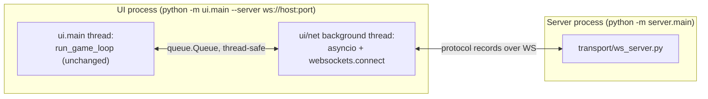

# KungFu Chess UI ↔ Server — Client Networking Plan

This is a planning document, not yet implemented. It designs the piece
[`docs/SERVER_PLAN.md`](SERVER_PLAN.md) §17 explicitly deferred: *"Where
does the client (`ui/`) get its network layer, and where does
`ClockEstimator` (§8) physically live?"* Today the two processes are real
but disconnected — `python -m server.main` runs a genuine WebSocket
listener (`server/transport/ws_server.py`), and `python -m ui.main` runs a
fully local, in-process `kungfu_chess.engine.GameEngine` (`ui/main.py`'s
`build_engine()`). Neither imports the other. This plan closes that gap.

**Verified against the actual tree:** every file/line cited below
(`ui/main.py:53-176`, `ui/input/controller.py`, `ui/animation/scene_builder.py:40-70`,
`kungfu_chess/engine/game_engine.py`, `kungfu_chess/realtime/real_time_arbiter.py`,
`server/protocol/{commands,events,state_records,codec}.py`,
`server/config.py`, `server/handlers/join_handler.py`) was read directly
from this repository this session, not inferred from a template.

**Updated after `docs/SQLITE_PERSISTENCE_PLAN.md` landed in code.**
`server/protocol/commands.py`'s `JoinCommand` now carries a mandatory
`password: str` (register-or-login, decided by `JoinHandler.handle()` —
`server/handlers/join_handler.py:38-56`), and `ErrorCode.INVALID_CREDENTIALS`
is real. Two consequences for this plan, folded in below: `ClientConfig`
needs a `password` field (§3, §9), and — the more important one —
**`JoinHandler.handle()` sends the first joiner in a session no
acknowledgment at all** (`join_handler.py:58-64`: `if result is None:
return`, no event, since `WelcomeEvent` only means something once a color
is assigned at pairing). `NetworkClient.connect()` must not block waiting
for a `WelcomeEvent` — a solo first player would hang forever. §7/§9/§10
below reflect this; it wasn't visible when this plan's first draft was
written, since `join_handler.py` hadn't been read yet.

## 0. The one hard constraint this plan is built around

**`ui/animation/`, `ui/rendering/`, `ui/hud/`, `ui/input/mouse_adapter.py`,
`ui/events/`, and `kungfu_chess/` itself must not change at all.** They
already depend on nothing but `kungfu_chess.engine.GameEngine`'s four
public methods (`request_move`, `request_jump`, `tick`,
`get_snapshot() -> GameSnapshot`) and `GameSnapshot`'s shape
(`board`, `motions`, `jumps`, `winner`, `current_time` —
`kungfu_chess/engine/game_engine.py:11-23`). If a networked client
presents that exact same surface, `ui/main.py::run_game_loop` (`ui/main.py:78-163`),
`kungfu_chess.input.Controller`, and `ui/animation/scene_builder.py` run
**unmodified** against a remote game. Everything in this plan exists to
make that substitution possible — it is the **Adapter** pattern, applied
once, at the composition root, rather than threaded through every
rendering/animation module that currently has no idea a network exists.

## 1. A prerequisite refactor: promote `protocol/` out of `server/`

`docs/SERVER_PLAN.md` §1 states a hard constraint: *"The server is its
own OS process. It never imports UI code and is **never imported by
it**."* Today `server/protocol/{commands,events,state_records,errors,codec}.py`
is the only correct place for `ui/net/` to get typed
`Command`/`Event`/record classes and the `encode`/`decode_event` codec —
but importing `server.protocol.*` from `ui/` would violate that
constraint literally, even though `protocol/` itself has zero dependency
on sockets, the bus, or session state (`server/protocol/commands.py`
imports only `kungfu_chess.model`).

**Fix: move `server/protocol/` to a new top-level `protocol/` package,**
sibling to `kungfu_chess/`, `ui/`, and `server/`, with no other change to
its contents. `server/` imports it as `protocol.*` instead of
`server.protocol.*`; `ui/net/` does the same. This is a shared-kernel
package in DDD terms — both processes depend on it, neither depends on
the other:

```
protocol/                    # moved verbatim from server/protocol/, zero content changes
  __init__.py
  commands.py                # JoinCommand, MoveCommand, JumpCommand, HeartbeatCommand
  events.py                  # WelcomeEvent, StateEvent, HeartbeatEvent, MoveRejectedEvent, GameOverEvent, ErrorEvent
  state_records.py           # PieceRecord, MotionRecord, JumpRecord
  errors.py                  # ErrorCode
  codec.py                   # encode/decode/decode_command/decode_event — the only (de)serialization code

server/
  ...                        # everything else unchanged; `from server.protocol...` becomes `from protocol...`
```

Mechanical, low-risk, and it turns §1's prose promise into something
§12's import-linter (below) can actually check — the same "promise worth
checking mechanically" reasoning `docs/SERVER_PLAN.md` §10 already uses.

## 2. Process topology, updated



Two threads inside the UI process, exactly mirroring the server's own
sync-core/async-shell split (`docs/SERVER_PLAN.md` §9): one asyncio task
is the *only* thing that touches a socket, and it's isolated behind a
thread-safe queue from everything else — including all of `ui/rendering`,
`ui/animation`, `ui/hud`, which stay 100% synchronous and know nothing
about threads or sockets, same as today.

## 3. Package layout

```
ui/
  net/
    __init__.py
    client_config.py         # ClientConfig — validated dataclass, mirrors server/config.py's ServerConfig
    network_client.py         # NetworkClient — owns the background asyncio thread; send()/queue of received Events
    clock_estimator.py        # ClockEstimator — the class docs/SERVER_PLAN.md §8 named but deliberately didn't build
    state_hydrator.py          # hydrate(StateEvent) -> GameSnapshot — pure function, the wire-to-domain Factory
    remote_game_engine.py      # RemoteGameEngine — the Adapter; same 4-method surface as kungfu_chess.engine.GameEngine
    heartbeat_sender.py         # ticked once per frame from RemoteGameEngine.tick(); sends HeartbeatCommand on schedule
  main.py                      # gains build_remote_engine(); still the one composition root
```

Nothing under `ui/animation/`, `ui/rendering/`, `ui/hud/`,
`ui/input/mouse_adapter.py`, or `ui/events/` appears in this list —
per §0, none of them change.

```python
# ui/net/client_config.py — mirrors server/config.py's ServerConfig: a
# validated dataclass, not bare constants, for exactly the same reason
# (values vary by deployment; a missing password shouldn't fail silently).
@dataclass(frozen=True)
class ClientConfig:
    uri: str
    username: str
    password: str                        # required — JoinCommand has no default, see the note at the top of this doc
    heartbeat_interval_ms: int = 2000     # matches ServerConfig's default; not required to match, just sensible
    connect_timeout_s: float = 5.0

    def __post_init__(self) -> None:
        if not self.uri:
            raise ValueError("uri must be non-empty")
        if not self.username:
            raise ValueError("username must be non-empty")
        if not self.password:
            raise ValueError("password must be non-empty")
        if self.heartbeat_interval_ms <= 0:
            raise ValueError("heartbeat_interval_ms must be positive")
```

## 4. `RemoteGameEngine`: the Adapter

```python
# ui/net/remote_game_engine.py
class RemoteGameEngine:
    """Same public surface as kungfu_chess.engine.GameEngine — request_move,
    request_jump, tick, get_snapshot — so Controller and SceneBuilder can't
    tell the difference. Never simulates a move locally: this is a thin,
    server-authoritative client (§7's non-goal below), so the only way a
    piece ever appears to move is a StateEvent saying it did.
    """
    def __init__(self, client: NetworkClient, clock: ClockEstimator, heartbeat: HeartbeatSender) -> None:
        self._client = client
        self._clock = clock
        self._heartbeat = heartbeat
        self._latest_snapshot: GameSnapshot = _EMPTY_SNAPSHOT   # until the first StateEvent arrives
        self._player_color: Optional[Color] = None              # set on WelcomeEvent

    def request_move(self, request: MoveRequest) -> bool:
        self._client.send(MoveCommand(trace_id=str(uuid.uuid4()), src=request.src, dst=request.dst))
        return True   # optimistic: Controller clears selection; a real StateEvent (or MoveRejectedEvent) reconciles it

    def request_jump(self, position: Position) -> bool:
        self._client.send(JumpCommand(trace_id=str(uuid.uuid4()), position=position))
        return True   # same reasoning

    def tick(self) -> None:
        self._heartbeat.tick(self._client)                # may send a HeartbeatCommand if due
        for event in self._client.drain():                 # non-blocking; everything received since last tick
            self._apply(event)

    def get_snapshot(self) -> GameSnapshot:
        return self._latest_snapshot                        # already clock-rebased — see §6

    def _apply(self, event: object) -> None:
        if isinstance(event, WelcomeEvent):
            self._player_color = event.color
        elif isinstance(event, StateEvent):
            self._latest_snapshot = hydrate(event, self._clock)   # §5
        elif isinstance(event, HeartbeatEvent):
            self._clock.observe(event)                       # §6
        elif isinstance(event, ErrorEvent) and event.reason is ErrorCode.INVALID_CREDENTIALS:
            raise AuthenticationError(event.reason)           # fatal — see §7, §10
        elif isinstance(event, (MoveRejectedEvent, ErrorEvent)):
            pass  # logged by NetworkClient already (§7's ActivityLogger-style trace); no popup UI in this milestone
        # PlayerJoinedEvent, GameOverEvent: already implied by the next StateEvent.winner / a 2nd player's presence


class AuthenticationError(Exception):
    """Raised from tick() when the server rejects this connection's
    JoinCommand credentials (docs/SQLITE_PERSISTENCE_PLAN.md §8). Deliberately
    propagates uncaught through Controller.on_tick() -> run_game_loop()
    (ui/main.py:126, untouched per §0) rather than being swallowed here —
    see §10's "no graceful login-failure UX" limitation.
    """
```

`request_move`/`request_jump` returning `True` unconditionally is a
deliberate, named simplification, not an oversight: `Controller.on_click`
(`kungfu_chess/input/controller.py:28-55`) only uses the boolean to decide
whether to clear the current selection. Since this client never predicts
outcomes locally, "optimistically clear selection, let the next
`StateEvent` be the truth" is the only option that doesn't require
teaching `Controller` (untouched, per §0) about pending/unconfirmed
state.

## 5. State hydration: wire records → the exact objects `SceneBuilder` already expects

`ui/animation/scene_builder.py:40-70` reads `snapshot.board.all_pieces()`,
`snapshot.motions` (each with `.piece`, `.src`, `.dst`, `.progress(now)`),
`snapshot.jumps` (each with `.piece`, `.cell`), and `snapshot.current_time`
— all real `kungfu_chess.model`/`kungfu_chess.realtime` objects, never a
raw dict. `hydrate()` is the Factory that builds those same object types
from `protocol.state_records`, so `SceneBuilder` never has to know its
input came off a socket:

```python
# ui/net/state_hydrator.py
def hydrate(event: StateEvent, clock: ClockEstimator) -> GameSnapshot:
    board = Board(rows=config.BOARD_ROWS, cols=config.BOARD_COLS)
    pieces_by_id: Dict[str, Piece] = {}
    for rec in event.pieces:
        piece = Piece(id=rec.id, color=rec.color, kind=rec.kind, cell=rec.cell, state=rec.state)
        pieces_by_id[rec.id] = piece
        if rec.state != PieceState.CAPTURED:
            board.place(piece, rec.cell)

    motions = [
        Motion(
            piece=pieces_by_id[m.piece_id], src=m.src, dst=m.dst, path=m.path,
            start_time=clock.to_local(m.start_time), duration=m.duration, sequence=0,  # sequence unused client-side
        )
        for m in event.motions
    ]
    jumps = [
        JumpAction(piece=pieces_by_id[j.piece_id], cell=j.cell,
                   start_time=clock.to_local(j.start_time), duration=j.duration)
        for j in event.jumps
    ]
    return GameSnapshot(board=board, motions=motions, jumps=jumps,
                         winner=event.winner, current_time=clock.to_local(event.current_time))
```

**A dependency this plan has on `docs/SERVER_PLAN.md` that isn't spelled
out there yet:** `SceneBuilder` unions `board.all_pieces()` with the
pieces referenced by `motions`/`jumps` specifically to keep rendering a
piece that was just captured mid-flight (the jumping-defender collision
path in `kungfu_chess/realtime/real_time_arbiter.py`'s
`_resolve_motion_step`, which removes the piece from `state.board` the
same tick it's captured). For that same piece to still animate correctly
on a networked client, **`StateEvent.pieces` must include it too** — the
server's not-yet-built `state_mapper.py` (`docs/SERVER_PLAN.md` §4) needs
to serialize the same `board ∪ motions ∪ jumps` union `SceneBuilder`
already computes, not `board.all_pieces()` alone. Flagging this here so
it isn't discovered as a rendering bug after both sides are built —
`docs/SERVER_PLAN.md` should pick this up as a one-line addition to its
`state_mapper.py` description.

## 6. Clock rebasing: `ClockEstimator`

This is the class `docs/SERVER_PLAN.md` §8 named as a **hard requirement,
not deferred** but explicitly left for "the not-yet-written `ui/net/`
plan" — this is that plan.

```python
# ui/net/clock_estimator.py
class ClockEstimator:
    """NTP-style midpoint offset from a stream of HeartbeatEvents. First
    sample sets the offset outright (no prior estimate to blend with —
    establishing the rebasing origin). Every sample after that is blended
    in with exponential smoothing so one noisy RTT doesn't snap the view.
    """
    def __init__(self, smoothing: float = 0.2) -> None:
        self._offset: Optional[float] = None
        self._smoothing = smoothing

    def observe(self, event: HeartbeatEvent, local_send_ms: int, local_receive_ms: int) -> None:
        rtt = local_receive_ms - local_send_ms
        sample_offset = event.server_time_ms - (local_send_ms + rtt / 2)
        if self._offset is None:
            self._offset = sample_offset
        else:
            self._offset += self._smoothing * (sample_offset - self._offset)

    def to_local(self, engine_ms_or_s: float) -> float:
        if self._offset is None:
            return engine_ms_or_s   # no sample yet — render un-rebased rather than block
        return engine_ms_or_s + self._offset
```

`local_send_ms`/`local_receive_ms` are tracked by `HeartbeatSender` (next
section) — the estimator itself stays a pure function of its inputs, unit
testable with fabricated timestamps and zero networking, same "pure, sync
core" discipline `docs/SERVER_PLAN.md` §9 applies server-side.

`HeartbeatSender` sends `HeartbeatCommand(trace_id, client_send_ms)` on a
fixed interval, ticked from `RemoteGameEngine.tick()` (so no extra thread
is needed — it piggybacks on the one call already made every UI frame),
and hands the matching `HeartbeatEvent` to `ClockEstimator.observe()` when
it comes back.

## 7. `NetworkClient`: the async shell, and the Producer/Consumer boundary

```python
# ui/net/network_client.py
class NetworkClient:
    """The ONLY class in ui/ that touches asyncio or a raw socket. Owns a
    background thread running its own event loop; everything else in ui/
    stays synchronous. Mirrors server/transport/ws_server.py's own rule —
    one real async driver, isolated behind a boundary — but the boundary
    here is a thread + queue.Queue instead of a single-process event loop,
    because the UI's frame loop is fundamentally a synchronous while-loop
    with time.sleep (ui/main.py:120-160), not asyncio.
    """
    def __init__(self, config: ClientConfig) -> None:
        self._config = config
        self._incoming: "queue.Queue[object]" = queue.Queue()
        self._loop: Optional[asyncio.AbstractEventLoop] = None
        self._websocket = None
        self._thread = threading.Thread(target=self._run, daemon=True)

    def connect(self) -> None:
        self._thread.start()
        # Blocks only until the WS handshake itself completes (or raises
        # ConnectionRefusedError/OSError on failure) — see §10. Deliberately
        # does NOT wait for a WelcomeEvent: JoinHandler.handle() sends the
        # first joiner in a session no acknowledgment at all
        # (server/handlers/join_handler.py:58-64), so blocking on Welcome
        # would hang forever for a solo first player. A rejected password
        # surfaces later, asynchronously, as an AuthenticationError raised
        # from RemoteGameEngine.tick() (§4) once the resulting ErrorEvent
        # is drained — not from connect() itself.

    def send(self, command: object) -> None:
        raw = codec.encode(command)
        asyncio.run_coroutine_threadsafe(self._websocket.send(raw), self._loop)  # thread-safe hand-off

    def drain(self) -> List[object]:
        events = []
        while True:
            try:
                events.append(self._incoming.get_nowait())
            except queue.Empty:
                return events

    def close(self) -> None:
        ...  # cancel the reader task, close the websocket, stop the loop, join the thread

    def _run(self) -> None:
        self._loop = asyncio.new_event_loop()
        asyncio.set_event_loop(self._loop)
        self._loop.run_until_complete(self._connect_and_read())

    async def _connect_and_read(self) -> None:
        async with websockets.connect(self._config.uri) as ws:
            self._websocket = ws
            self.send(JoinCommand(
                trace_id=str(uuid.uuid4()),
                username=self._config.username,
                password=self._config.password,   # register-or-login; see the note at the top of this doc
            ))
            async for raw in ws:
                self._incoming.put(codec.decode_event(raw))
```

This is the **Producer/Consumer** pattern: the background thread's
`_connect_and_read` coroutine is the sole producer onto `_incoming`;
`RemoteGameEngine.tick()` (called once per rendered frame, main thread) is
the sole consumer via `drain()`. `queue.Queue` is already thread-safe, so
no additional locking is needed anywhere in `ui/net/` — the queue *is*
the entire synchronization surface, same "one narrow, named boundary"
shape as `docs/SERVER_PLAN.md` §9.1's `now_ms` boundary.

## 8. Design patterns used, and why

| Pattern | Where | Why here specifically |
|---|---|---|
| **Adapter** | `ui/net/remote_game_engine.py` | Presents the exact `request_move`/`request_jump`/`tick`/`get_snapshot` surface `Controller` and `SceneBuilder` already call, so §0's constraint (zero changes outside `ui/net/`+`ui/main.py`) holds. Mirrors `docs/SERVER_PLAN.md` §6's own `session/game_session.py` Adapter — same technique, opposite side of the wire. |
| **Factory** | `ui/net/state_hydrator.py`'s `hydrate()` | Turns wire records (`PieceRecord`/`MotionRecord`/`JumpRecord`) into real `kungfu_chess.model.Piece`/`Board`, `kungfu_chess.realtime.Motion`/`JumpAction` instances — the client-side mirror of the server's own (planned) `state_mapper.py`, same registry-driven idea as `protocol/codec.py`'s `{type_name: dataclass}` table. |
| **Producer/Consumer** | `ui/net/network_client.py`'s `queue.Queue` | The one and only concurrency boundary in `ui/`. Isolates all asyncio/socket code in a single background thread; every other `ui/net/` class stays synchronous and directly unit-testable, same as `docs/SERVER_PLAN.md` §9's sync-core discipline. |
| **Strategy** (via DI, not a formal `Protocol`) | `ui/main.py`'s `build_engine()` vs. new `build_remote_engine()` | Both return something implementing the same 4-method surface; `main()` picks one by config, so `run_game_loop`/`Controller` never branch on "am I networked" — see §0 and §9. |
| **Observer / Pub-Sub** | `ui/events/event_bus.py` (unchanged, reused as-is) | `RemoteGameEngine.get_snapshot()` feeds `capture_frame_snapshot`/`diff_snapshots` exactly like the local engine did (`ui/main.py:127-135`) — the HUD (`ScorePanel`, `MoveLogPanel`, `PlayerLabels`) needs zero awareness that a network now exists underneath it. |
| **Dependency Injection** | `ui/main.py` (still the one composition root) | `NetworkClient`, `ClockEstimator`, `HeartbeatSender`, `RemoteGameEngine` are all constructed once, wired via constructor args, no globals/singletons — same rule `docs/SERVER_PLAN.md` §11 states for `server/main.py`. |

## 9. Composition root: `ui/main.py`

```python
# ui/main.py — additions only; build_engine()/build_canvas()/run_game_loop() untouched

def build_remote_engine(client_config: ClientConfig) -> RemoteGameEngine:
    client = NetworkClient(client_config)
    client.connect()                                    # blocks until Welcome or a connect error — see §10
    clock = ClockEstimator()
    heartbeat = HeartbeatSender(interval_ms=client_config.heartbeat_interval_ms)
    return RemoteGameEngine(client, clock, heartbeat)


def main() -> None:
    args = _parse_args()                                 # argparse, same style as ui/tests/manual/*.py
    if args.server:
        engine = build_remote_engine(ClientConfig(uri=args.server, username=args.username, password=args.password))
    else:
        engine = build_engine()                           # today's fully local path — still the default
    ...
    canvas = build_canvas()
    run_game_loop(engine, canvas)                          # completely unaware which branch built `engine`
```

`python -m ui.main` with no `--server` flag keeps working exactly as it
does today — the local, offline path is not removed, just made one of two
`Strategy` choices at the composition root. `run_game_loop` itself
(`ui/main.py:78-163`) needs zero changes: it only ever calls
`engine.get_snapshot()`/`engine.tick()` and hands the result to code that
already doesn't care where the engine lives.

## 10. Failure modes accepted for v1 (naming them, not hiding them)

Same spirit as `docs/SERVER_PLAN.md` §16 — cheaper to name now than
rediscover mid-implementation:

- **No reconnect.** Matches `docs/SERVER_PLAN.md` §16's own "No reconnect
  identity" — a dropped connection just stops updating
  `RemoteGameEngine`'s snapshot; the last-known board freezes on screen.
  No auto-retry, no `PAUSED_DISCONNECTED` UI state, this milestone.
- **No client-side prediction or rollback.** §4 already names this: every
  move/jump is fire-and-forget until the next `StateEvent` confirms or
  silently doesn't. Simplest correct thing for a real-time,
  server-authoritative game with a low-latency local network target
  (classroom/LAN); revisit only if perceived input lag is a measured
  problem, not a speculative one.
- **`connect()` blocking the composition root, but only for the TCP/WS
  handshake.** `NetworkClient.connect()` waits for the socket to open
  before `main()` proceeds to build the canvas, but — per §7 — does
  **not** wait for a `WelcomeEvent`, since a solo first joiner legitimately
  never gets one until a second player pairs
  (`server/handlers/join_handler.py:58-64`). Simplest possible startup
  sequencing at the cost of the window not opening until the server is at
  least reachable. A connecting/error splash screen is a `ui/hud/`
  addition, explicitly out of scope here.
- **No graceful login-failure UX.** A rejected password
  (`ErrorCode.INVALID_CREDENTIALS`, `docs/SQLITE_PERSISTENCE_PLAN.md` §8)
  surfaces as an uncaught `AuthenticationError` propagating out of
  `RemoteGameEngine.tick()` through `Controller.on_tick()` and crashing
  `run_game_loop` with a traceback (§4) — not a HUD message, not a retry
  prompt. Correct (the game never renders against an unauthenticated
  connection) but not friendly. `docs/SQLITE_PERSISTENCE_PLAN.md` §13
  flags this exact gap from the server side ("full login UX ... undesigned
  ... the `ui/net/` client-side plan owns how that's presented") — this is
  that plan owning it, by explicitly deferring it rather than guessing at
  a UI treatment now.
- **Cleartext `ws://`, password sent in the clear inside `JoinCommand`.**
  Same acceptance as `docs/SERVER_PLAN.md` §16 and
  `docs/SQLITE_PERSISTENCE_PLAN.md` §7/§13 — fine for local/classroom use,
  flagged so it isn't forgotten if this ever leaves localhost; revisit
  transport (`wss://`) and server-side hashing (`argon2`) together, not
  separately.
- **`ClockEstimator`'s smoothing constant (`0.2` above) is a guess,** not
  measured — same "tune once real jitter is observable" caveat
  `docs/SERVER_PLAN.md` §16 already applies to its own server-side
  constants.

## 11. Layering enforcement: import-linter contract additions

Extends `docs/SERVER_PLAN.md` §10's `.importlinter` config (root packages
gain `protocol`, per §1 above):

```ini
[importlinter:contract:protocol-is-a-leaf]
name = The shared protocol package depends on nothing project-specific but the engine's value types
type = forbidden
source_modules = protocol
forbidden_modules = server, ui, kungfu_chess.engine, kungfu_chess.realtime, kungfu_chess.rules
# protocol/ may import kungfu_chess.model (Position, Color, PieceKind, PieceState) — nothing else.

[importlinter:contract:server-is-independent-of-ui]
name = The server package never imports UI code (docs/SERVER_PLAN.md §1)
type = forbidden
source_modules = server
forbidden_modules = ui

[importlinter:contract:ui-net-is-the-only-network-seam]
name = Only ui.net (and the ui.main composition root) may depend on the wire protocol or websockets
type = forbidden
source_modules = ui.animation, ui.rendering, ui.hud, ui.input, ui.events, ui.assets, ui.platform
forbidden_modules = protocol, websockets, server

[importlinter:contract:ui-never-imports-server-internals]
name = ui.net may depend on the shared protocol, never on server's own packages
type = forbidden
source_modules = ui
forbidden_modules = server.transport, server.session, server.handlers, server.matchmaking, server.persistence, server.bus, server.logging_
```

`graded-path-is-network-free` (`docs/SERVER_PLAN.md` §10, `source_modules
= main, texttests, kungfu_chess`) is untouched — it already didn't
mention `ui`, and doesn't need to: `ui.net` depending on `websockets` is
correct and intended, `kungfu_chess`/root `main.py`/`texttests` still
never do.

## 12. Testing strategy

Mirrors `docs/SERVER_PLAN.md` §13's split — pure/sync gets unit tests,
the asyncio/socket shell gets one real integration test:

- `state_hydrator.hydrate()` — pure function; feed a hand-built
  `StateEvent` in, assert the resulting `GameSnapshot`'s board/motions/jumps
  match, no server, no socket, no thread.
- `ClockEstimator` — pure; feed fabricated `HeartbeatEvent`s + timestamps,
  assert first-sample-sets-offset and later-samples-smooth behavior.
- `RemoteGameEngine` — construct with a **fake** `NetworkClient` (records
  `send()` calls, `drain()` returns a pre-loaded list) — proves
  `request_move`/`tick`/`get_snapshot` wiring without any real I/O, same
  `FakeConnection`-style substitution `docs/SERVER_PLAN.md` §13 uses
  server-side. Also proves: a drained `ErrorEvent(reason=INVALID_CREDENTIALS)`
  raises `AuthenticationError` from `tick()`; a drained `MoveRejectedEvent`
  does not raise anything.
- `NetworkClient.connect()` does not block on a `WelcomeEvent` — proven
  against a fake/real server that never pairs a second player: `connect()`
  still returns once the handshake completes.
- `NetworkClient` itself — one real integration test: start a real
  `server.main.run_server` (or the existing test harness for it) in the
  same process/event loop, connect a real `NetworkClient`, assert a sent
  `MoveCommand` produces the expected `StateEvent` round-trip.
  `pragma: no cover` for anything below that — same carve-out
  `docs/SERVER_PLAN.md` §9.1 gives `server/scheduler.py`, for the same
  reason (nothing here is worth unit-testing in isolation from a real
  loop).
- Existing `ui/tests/unit` suite: **unchanged, stays green** — nothing it
  covers (`FakeCanvas`, rendering, animation, HUD) depends on where the
  engine came from.

## 13. Implementation phases & regression gate

Same gate discipline as `docs/SERVER_PLAN.md` §14: `python -m pytest`
(existing suite, byte-for-byte unchanged) stays green throughout; no
phase touches `kungfu_chess/`, `ui/animation/`, `ui/rendering/`,
`ui/hud/`, `ui/input/mouse_adapter.py`, or `ui/events/`.

| Phase | Adds | Proven by |
|---|---|---|
| 0 | Move `server/protocol/` → `protocol/` (§1); update `server/`'s imports; import-linter contracts (§11) wired in | Existing `server/` test suite stays green after the mechanical move; linter reports zero violations |
| 1 | `ui/net/state_hydrator.py`, `ui/net/clock_estimator.py` — pure, no I/O | Unit tests per §12, no server process involved |
| 2 | `ui/net/network_client.py`, `ui/net/heartbeat_sender.py` | One real-`websockets` integration test against a running `server.main` instance: connect → Join → Welcome |
| 3 | `ui/net/remote_game_engine.py` | Unit tests with a fake `NetworkClient` (§12): a queued `StateEvent` produces the right `get_snapshot()`; `request_move` calls `send()` with a `MoveCommand` and returns `True` |
| 4 | `ui/main.py`'s `build_remote_engine()` + `--server`/`--username` CLI flags | Manual verification: `python -m server.main` + two `python -m ui.main --server ws://127.0.0.1:8765 --username X` windows show the same live board |

## 14. Open questions before implementation starts

1. Does `docs/SERVER_PLAN.md`'s `state_mapper.py` already plan to union
   `board.all_pieces()` with motion/jump pieces the way `SceneBuilder`
   does (§5 above)? Not confirmed in the current document — worth a
   one-line addition there before phase 2 (§13) starts, so both sides
   agree on `StateEvent.pieces`'s exact contents.
2. Blocking `connect()` (§10) vs. an async "connecting..." splash — sequencing
   choice, not an architecture question; deferred to whoever implements
   phase 4 to decide against real startup latency, not guessed here.
3. Exact `ClockEstimator` smoothing constant and `HeartbeatSender`
   interval — same "not knowable from design alone, tune once real
   network jitter is observable" caveat `docs/SERVER_PLAN.md` §16/§17
   already applies to the server's own timing constants.
4. Should `RemoteGameEngine`'s dropped `MoveRejectedEvent`/non-fatal
   `ErrorEvent` (§4's `_apply`, currently a silent `pass`) surface anywhere
   visible — a HUD toast, a console line? Left undesigned; today's local
   `Controller` has no equivalent concept (a local move is either legal or
   the click is simply ignored), so there's no existing UI pattern to
   extend. Worth a real decision once this is actually being played
   against a real server, not speculated here. (Login failure is no longer
   part of this question — §4/§10 now make `INVALID_CREDENTIALS` fatal by
   design, not silent.)
5. A crash-on-bad-password is correct but blunt (§10). Once there's an
   actual login UI (a username/password prompt, presumably `ui/hud/` or a
   pre-game screen — not designed by this document or
   `docs/SQLITE_PERSISTENCE_PLAN.md`), `AuthenticationError` should
   probably be caught at that layer and re-prompt instead of propagating
   into a crash. Not designed here — no login UI exists yet to catch it.
6. `JoinHandler`'s first-joiner-waits-silently behavior (§0's update note)
   means a solo player's window shows an empty/waiting board with no
   confirmation they're even connected correctly. A "waiting for
   opponent..." HUD state would need `PlayerJoinedEvent`'s absence to be
   observable, which it already is (`RemoteGameEngine` just never gets one)
   — but building that indicator is a `ui/hud/` addition, out of scope
   here.
